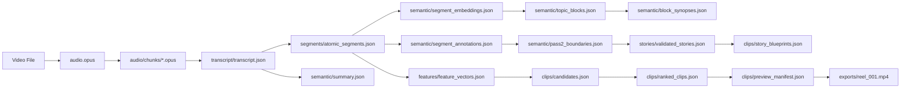
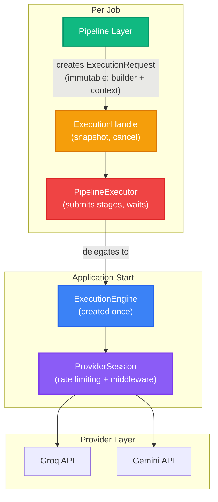
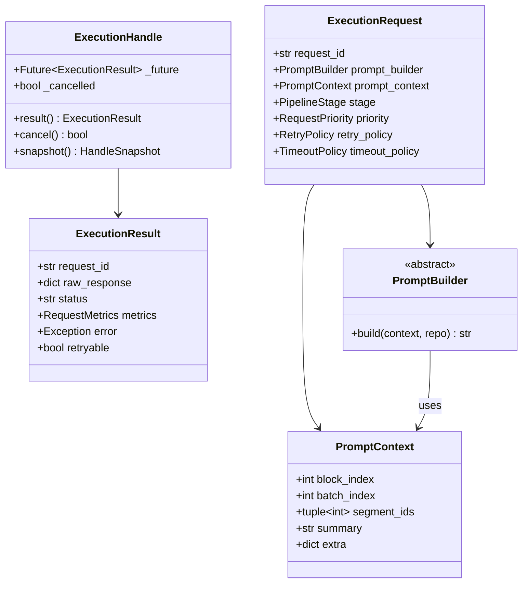
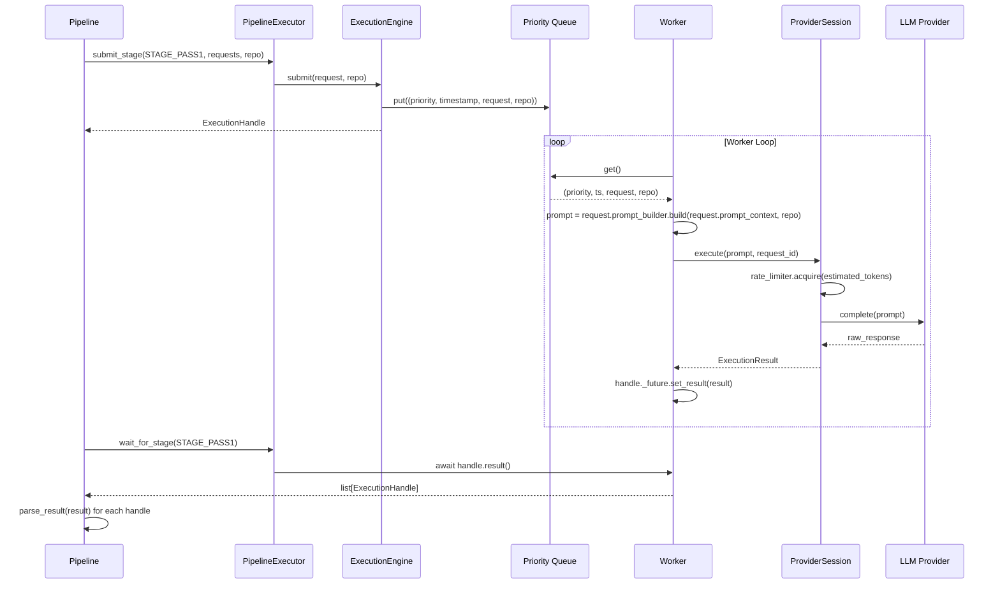
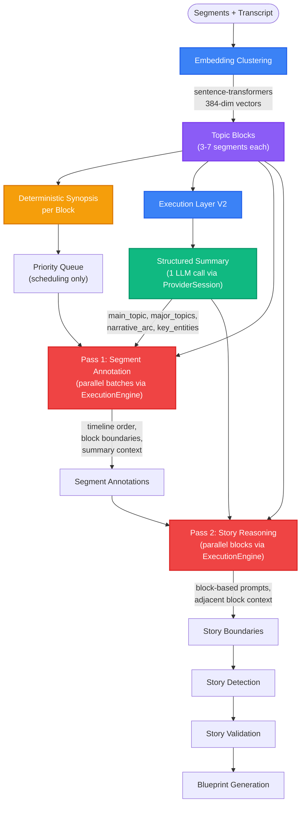
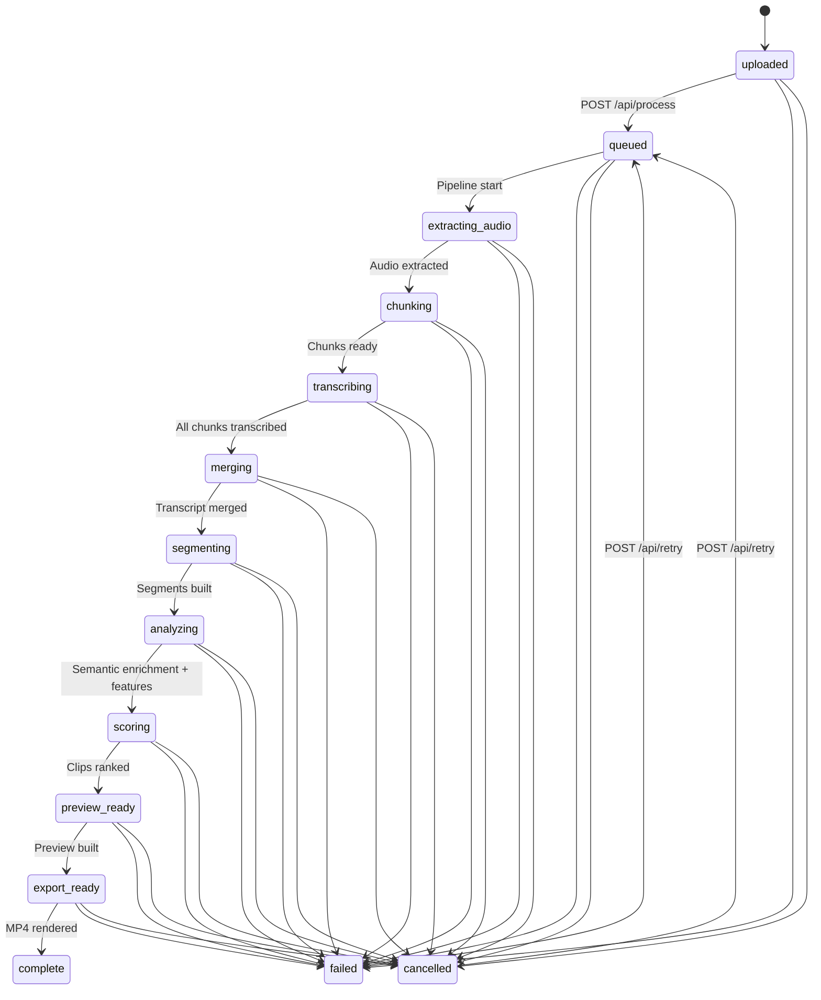
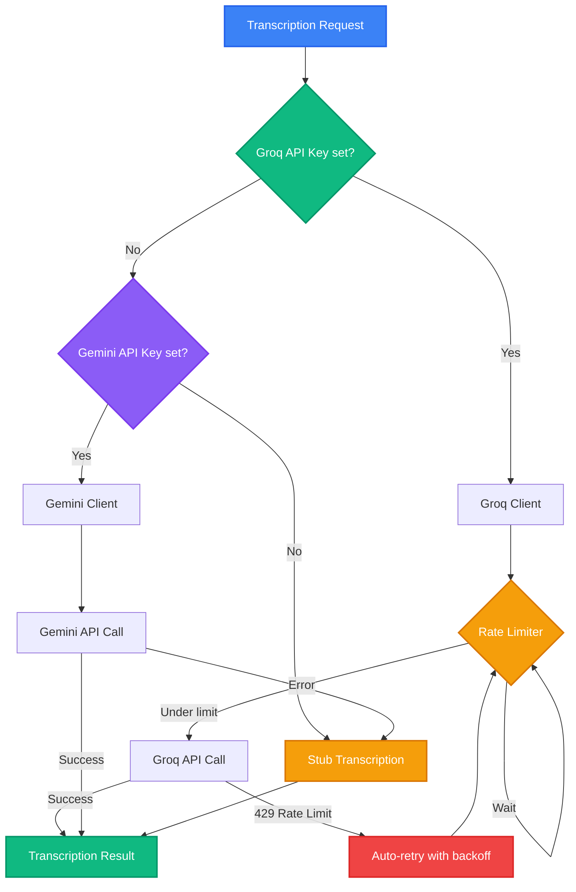
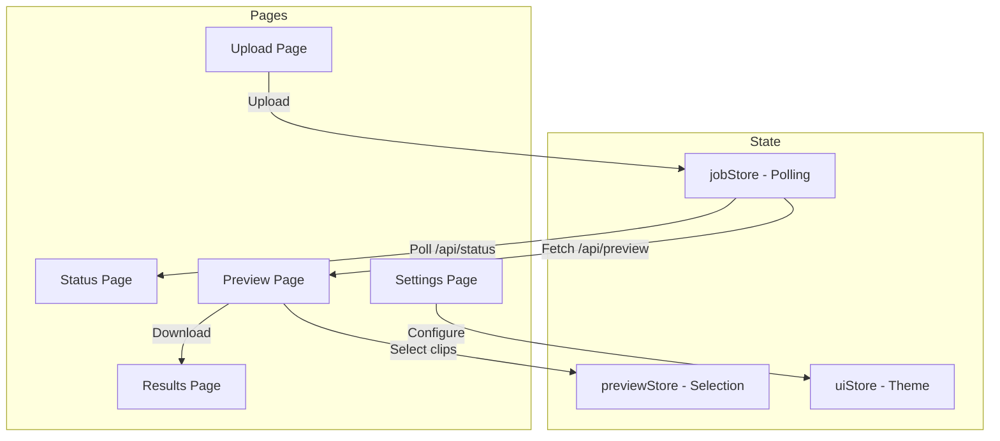

# Trimora

[](https://opensource.org/licenses/MIT)
[](https://www.python.org/downloads/)
[](https://fastapi.tiangolo.com/)
[](https://react.dev/)
[](https://ffmpeg.org/)
[]()

> AI-powered platform that transforms long-form videos into engaging short-form clips using an audio-first processing pipeline with embedding-based semantic enrichment and LLM story reasoning.

---

## Quick Navigation

- [Overview](#overview)
- [Features](#features)
- [Tech Stack](#tech-stack)
- [Architecture](#architecture)
- [Execution Layer V2](#execution-layer-v2)
- [Semantic Enrichment Pipeline](#semantic-enrichment-pipeline)
- [Project Structure](#project-structure)
- [Production Pipeline](#production-pipeline)
- [Job Lifecycle](#job-lifecycle)
- [API Reference](#api-reference)
- [Ranking Engine](#ranking-engine)
- [Frontend](#frontend)
- [Configuration](#configuration)
- [Setup](#setup)
- [Docker](#docker)
- [Storage](#storage)
- [Testing](#testing)
- [License](#license)

---

## Overview

Trimora takes a long video (podcast, lecture, interview) and automatically extracts the best short-form clips. The pipeline processes audio independently of video, using parallel transcription, embedding-based topic clustering, LLM-driven semantic enrichment, multi-signal feature extraction, and a multi-stage ranking engine to identify the most engaging moments.

**Processing time estimates** (with rate-limited transcription):

| Video Length | Chunks | Transcription | Semantic | Total |
|---|---|---|---|---|
| 30 minutes | 40 | ~160s | ~8s | ~3 min |
| 1 hour | 40 | ~160s | ~8s | ~3 min |
| 3 hours | 120 | ~480s | ~20s | ~9 min |
| 4 hours | 160 | ~640s | ~25s | ~12 min |

> **Execution Layer V2** reduces semantic processing from ~6 min to ~2-3 min (~40-50% improvement) through async parallel execution, provider-agnostic request handling, and concurrent worker pools.

---

## Features

| Feature | Description |
|---|---|
| Audio-First Processing | Extract audio once, process independently of video |
| Parallel Transcription | Rate-limited concurrent processing (Groq/Gemini) |
| Adaptive Chunking | Dynamic chunk sizes based on video duration |
| Execution Layer V2 | Provider-agnostic async engine with priority queuing |
| Embedding Topic Clustering | sentence-transformers for adaptive block boundaries |
| LLM Semantic Enrichment | Pass 1: segment annotation, Pass 2: story boundary detection |
| Structured Summary | Global video summary as root semantic artifact |
| Block Synopses | Deterministic per-block summaries for debugging and reuse |
| Story Detection & Repair | Candidate formation, verification, and repair |
| Blueprint Generation | Story-to-blueprint conversion with cut selection |
| Multi-Stage Ranking | Semantic deduplication with MMR optimization |
| Checkpointing | Pass 1 and Pass 2 resume from last completed batch |
| FFmpeg Rendering | Direct MP4 clip export |
| Learning Pipeline | Continuous improvement from analytics |
| Dark Theme UI | Modern React frontend with dark mode |

---

## Tech Stack

| Layer | Technology |
|---|---|
| Backend | Python 3.11+, FastAPI, Pydantic v2 |
| Frontend | React 18, TypeScript, Vite, Tailwind CSS |
| Media Processing | FFmpeg, ffprobe |
| Transcription | Groq (whisper-large-v3-turbo), Google Gemini (gemini-2.0-flash) |
| Embeddings | sentence-transformers (all-MiniLM-L6-v2), TF-IDF fallback |
| LLM (Semantic) | Groq (Llama 3.1), Gemini — for Pass 1/2 semantic enrichment |
| Concurrency | asyncio worker pools with semaphore |
| Storage | Local JSON files (database-ready architecture) |
| Deployment | Docker Compose, Windows batch launcher |

---

## Architecture

### High-Level System Architecture

```mermaid
flowchart LR
    subgraph Frontend ["Frontend"]
        U["User"] --> FE["React SPA"]
    end

    subgraph Backend ["Backend"]
        FE -->|POST /api/process| API["FastAPI"]
        API --> ORC["Orchestrator"]
        ORC --> PIPE["Production Pipeline"]
    end

    subgraph Ingestion ["Ingestion"]
        PIPE --> EXT["Audio Extraction"]
        EXT --> CHUNK["Chunk Planning"]
        CHUNK --> SCHED["Scheduler"]
    end

    subgraph Transcription ["Parallel Transcription"]
        SCHED --> WP["Worker Pool"]
        WP --> TRANS["Transcription"]
        TRANS -->|whisper| GROQ["Groq API"]
        TRANS -->|fallback| GEMINI["Gemini API"]
        TRANS --> MERGE["Transcript Merge"]
    end

    subgraph Analysis ["Analysis"]
        MERGE --> SEG["Segmentation"]
        SEG --> FEAT["Feature Extraction"]
    end

    subgraph Semantic ["Semantic Enrichment"]
        FEAT --> EMB["Embedding Clustering"]
        EMB --> BLOCKS["Topic Blocks"]
        BLOCKS --> SYN["Block Synopses"]
        SYN --> PRI["Priority Queue"]
        SYN --> SUM["Structured Summary"]
        SUM --> P1["Pass 1: Annotation"]
        P1 --> P2["Pass 2: Story Reasoning"]
        P2 --> SD["Story Detection"]
        SD --> SV["Story Validation"]
        SV --> BG["Blueprint Generation"]
    end

    subgraph Output ["Output"]
        FEAT --> RANK["Ranking Engine"]
        RANK --> PREV["Preview"]
        PREV --> RENDER["FFmpeg Render"]
    end

    subgraph Learning ["Background Learning"]
        RENDER --> LEARN["Analytics"]
        LEARN --> STORE[("Local Storage")]
    end
```



### Data Flow



---

## Execution Layer V2

The Execution Layer V2 replaces service-driven LLM execution with a provider-agnostic engine. This reduces semantic processing time by ~40-50% through async parallel execution and proper rate limiting.

### Architecture



### Key Components

| Component | Location | Purpose |
|---|---|---|
| `ExecutionEngine` | `backend/execution/engine.py` | Generic task runner with priority queue, workers, retries, timeouts |
| `PipelineExecutor` | `backend/execution/engine.py` | Orchestrates pipeline stages; does NOT parse results |
| `ProviderSession` | `backend/execution/provider_session.py` | Rate limiting, token estimation, middleware chain |
| `AsyncRateLimiter` | `backend/execution/provider_session.py` | Sliding-window token bucket (never blocks event loop) |
| `SegmentRepository` | `backend/execution/repository.py` | Read-only data access for prompt construction |
| `PromptBuilder` | `backend/execution/models.py` | Abstract base; each service implements its own |
| `PromptContext` | `backend/execution/models.py` | Lightweight, immutable context (IDs, not full objects) |
| `ExecutionProfiler` | `backend/execution/profiler.py` | Event-based timing and metrics collection |

### Data Types



### Request Flow



### Design Principles

| Principle | Implementation |
|---|---|
| **ExecutionRequest is immutable** | `frozen=True` dataclass; PromptContext contains IDs, not objects |
| **PromptBuilder stays in each service** | Each service owns its prompt construction logic |
| **Response parsing stays in each service** | Each service owns `parse_result()` — engine never parses |
| **ProviderSession owns rate limiting** | AsyncRateLimiter uses sliding window; lock released before sleep |
| **PipelineExecutor only orchestrates** | Registers stages, submits requests, waits — no result parsing |
| **ExecutionEngine owns scheduling** | Priority queue, worker pools, retries, timeouts, event emission |
| **SegmentRepository is read-only** | Created per job; PromptBuilder resolves IDs through it |
| **Engine lifetime is application-wide** | Created once at app start, shared across all jobs |
| **Middleware wraps the provider** | Logging, auth, compression at provider level, not scheduling level |
| **Error classification** | `_is_retryable()` differentiates rate limits, timeouts, network, invalid response, provider errors |

### Event-Based Profiling

The engine emits events for monitoring and profiling:

| Event | When | Payload |
|---|---|---|
| `request_queued` | Request submitted to queue | request_id, stage, priority, queue_size |
| `request_started` | Worker picks up request | request_id, attempt |
| `request_completed` | Successful completion | request_id, tokens, execution_time |
| `request_failed` | Non-retryable failure | request_id, error, retryable |
| `request_retry` | Retryable failure | request_id, attempt, error |
| `request_timeout` | Execution timeout | request_id |
| `request_cancelled` | Handle cancelled | request_id |

---

## Semantic Enrichment Pipeline

The semantic enrichment layer uses an **embedding-first architecture** that dramatically reduces LLM calls while improving quality through global context.

### Pipeline Flow



### Embedding Clustering

Segments are grouped into topic blocks using sliding window embeddings:

| Parameter | Default | Description |
|---|---|---|
| `min_window` | 3 | Minimum segments per block |
| `target_window` | 5 | Target segments per block |
| `max_window` | 7 | Maximum segments per block |
| `max_duration` | 60s | Max block duration (windows expand if below) |
| `max_tokens` | 2000 | Max tokens per block (windows shrink if above) |
| `threshold_std` | 1.5 | Z-score threshold for boundary detection |
| `smoothing_window` | 3 | Local smoothing window for adaptive threshold |

### Token Savings

| Metric | Before | After | Reduction |
|---|---|---|---|
| Pass 1 batches | 98 | 17 | 83% |
| Pass 2 batches | 20 | 5 | 75% |
| Total LLM calls | 118 | 23 | 81% |
| Total tokens | ~145K | ~35K | 76% |

### Key Design Decisions

- **Timeline order is immutable** — semantic pipeline never reorders segments; priority queue is only for job scheduling
- **No auto-merging of short blocks** — Story Detection decides whether blocks belong together
- **Deterministic synopses** — fixed template for debugging and versioning
- **Structural vs semantic confidence kept separate** — embedding clustering provides structural confidence, LLM provides semantic confidence
- **Block embeddings persisted** — reusable for search, duplicate detection, and recommendations
- **Summary includes representative excerpts** — grounded in actual transcript wording, not just synopses
- **PromptBuilder per service** — each service owns its prompt construction; PromptContext is lightweight (IDs, not objects)
- **Execution Layer for LLM calls** — Summary, Pass 1, Pass 2 run through ProviderSession with async rate limiting and parallel workers

---

## Project Structure

```text
trimora/
├── backend/
│   ├── main.py                          # Uvicorn entry point
│   ├── app/
│   │   ├── app.py                       # FastAPI app factory
│   │   └── lifespan.py                  # Startup/shutdown lifecycle (engine lifecycle)
│   ├── api/
│   │   ├── routes/
│   │   │   ├── process.py               # POST /api/process
│   │   │   ├── status.py                # GET /api/status/{job_id}
│   │   │   ├── preview.py               # GET /api/preview/{job_id}
│   │   │   └── export.py                # Result, retry, cancel, export, download
│   │   └── middleware/
│   │       ├── cors.py                  # CORS configuration
│   │       ├── errors.py                # Global error handler
│   │       └── logging.py               # Request timing
│   ├── config/
│   │   ├── settings.py                  # Settings dataclass + YAML loader
│   │   ├── runtime.yaml                 # Runtime configuration
│   │   ├── thresholds.py                # Scoring thresholds
│   │   ├── ranking_config.py            # Ranking engine parameters
│   │   ├── semantic_config.py           # Story quality weights, rejection thresholds
│   │   └── worker_limits.py             # Worker pool limits
│   ├── execution/                       # Execution Layer V2 (provider-agnostic engine)
│   │   ├── __init__.py                  # Package exports
│   │   ├── models.py                    # PromptBuilder, PromptContext, ExecutionRequest, etc.
│   │   ├── provider_session.py          # ProviderSession, AsyncRateLimiter, Middleware
│   │   ├── repository.py                # SegmentRepository (read-only data access)
│   │   ├── engine.py                    # ExecutionEngine + PipelineExecutor
│   │   └── profiler.py                  # Event-based profiling
│   ├── models/
│   │   ├── clip.py                      # ClipCandidate, PreviewManifest
│   │   ├── feature.py                   # SegmentFeatures
│   │   ├── generation_state.py          # BlueprintGenerationState, PipelineTiming
│   │   ├── graph.py                     # KnowledgeGraph
│   │   ├── job.py                       # JobStatus, JobRecord
│   │   ├── learning.py                  # LearningEntry, AnalyticsSummary
│   │   ├── segment.py                   # AtomicSegment
│   │   ├── semantic.py                  # SegmentAnnotation, LLMStoryBoundary
│   │   ├── story.py                     # StoryCandidate, Story, StoryCoverage
│   │   ├── story_blueprint.py           # StoryBlueprint
│   │   ├── topic_block.py               # TopicBlock, PriorityQueue, StoryBoundary
│   │   └── transcript.py               # TranscriptChunk
│   ├── services/
│   │   ├── audio_service.py             # FFmpeg audio extraction
│   │   ├── transcription_service.py     # Groq/Gemini transcription
│   │   ├── segmentation_service.py      # Atomic segment creation
│   │   ├── feature_service.py           # Multi-signal feature extraction
│   │   ├── graph_service.py             # Knowledge graph construction
│   │   ├── scoring_service.py           # Candidate scoring
│   │   ├── embedding_service.py         # TF-IDF + sentence-transformers
│   │   ├── embedding_clusterer.py       # Topic block clustering
│   │   ├── block_synopsis_generator.py  # Deterministic block synopses
│   │   ├── priority_ranker.py           # Block priority ranking
│   │   ├── transcript_summarizer.py     # Structured video summary (PromptBuilder + create_request)
│   │   ├── semantic_service.py          # Pass 1: segment annotation (PromptBuilder + create_requests)
│   │   ├── story_reasoner.py            # Pass 2: story boundary detection (PromptBuilder + create_requests)
│   │   ├── story_detector.py            # Candidate formation + repair
│   │   ├── story_validator.py           # Quality scoring + rejection
│   │   ├── coverage_analyzer.py         # Segment coverage analysis
│   │   ├── blueprint_generator.py       # Story-to-blueprint conversion
│   │   ├── duplicate_guard.py           # Composite duplicate detection
│   │   ├── llm_provider.py              # Groq/Gemini/Rule-based LLM providers + estimate_tokens()
│   │   ├── preview_service.py           # Preview manifest building
│   │   ├── rendering_service.py         # FFmpeg clip rendering
│   │   └── storage_service.py           # File storage helpers
│   ├── pipelines/
│   │   ├── production_pipeline.py       # Main pipeline (uses ExecutionEngine + PipelineExecutor)
│   │   ├── orchestrator.py              # Job orchestration (accepts engine parameter)
│   │   ├── analytics_pipeline.py        # Analytics summarization
│   │   ├── learning_pipeline.py         # Background learning
│   │   └── event_bus.py                 # Pipeline event system (with subscribers)
│   ├── ranking/
│   │   ├── pipeline.py                  # RankingEngine (13-stage)
│   │   ├── models.py                    # Candidate, RankedClip, RankingResult
│   │   ├── hard_constraints.py          # Duration, order, gap filtering
│   │   ├── narrative.py                 # Semantic coherence
│   │   ├── context.py                   # Contextual coherence
│   │   ├── hook_quality.py              # Hook effectiveness
│   │   ├── density.py                   # Information density
│   │   ├── retention.py                 # Viewer retention prediction
│   │   ├── novelty.py                   # Semantic deduplication
│   │   ├── tie_breaker.py              # Tie-breaking logic
│   │   ├── confidence.py               # Confidence scoring
│   │   ├── explanation.py              # Human-readable explanations
│   │   └── optimizer.py                # MMR optimization
│   ├── storage/
│   │   ├── file_store.py                # JSON file persistence
│   │   ├── job_store.py                 # Job state management
│   │   ├── manifest_store.py            # Preview manifest storage
│   │   └── state_store.py              # State persistence
│   ├── workers/
│   │   ├── scheduler.py                 # Task scheduling
│   │   ├── worker_pool.py               # Async worker pool
│   │   ├── transcription_worker.py      # Transcription workers
│   │   ├── feature_worker.py            # Feature extraction workers
│   │   ├── clip_worker.py               # Clip rendering workers
│   │   └── learning_worker.py           # Learning workers
│   ├── utils/
│   │   ├── text_utils.py                # Text processing
│   │   ├── audio_utils.py               # Audio utilities
│   │   ├── time_utils.py                # Time formatting
│   │   ├── validation.py                # Input validation
│   │   └── logging.py                   # Logging configuration
│   └── tests/                           # 20 test files (126 tests)
├── frontend/
│   └── src/
│       ├── app/                         # App shell, router
│       ├── pages/                       # 5 page components
│       ├── components/                  # Reusable UI components
│       ├── hooks/                       # Custom React hooks
│       ├── services/                    # API client services
│       ├── store/                       # Zustand state management
│       ├── styles/                      # Tailwind + theme CSS
│       └── types/                       # TypeScript types
├── shared/                              # Shared schemas, contracts
├── docker/                              # Dockerfiles
├── storage/                             # Runtime job data (gitignored)
├── docker-compose.yml
├── start.bat                            # Windows launcher
└── .env.example                         # Environment template
```

---

## Production Pipeline

The pipeline processes videos through sequential stages with cancellation checks and error handling between each stage. LLM calls (Summary, Pass 1, Pass 2) are executed through the **Execution Layer V2** for parallel execution.

```mermaid
flowchart TB
    START([Start]) --> CHK{FFmpeg installed?}
    CHK -->|No| FAIL1[Fail: ffmpeg not found]
    CHK -->|Yes| EXT[Extract Audio]

    EXT --> PLAN[Plan Chunks]
    PLAN --> SPLIT[Split Audio Chunks]

    SPLIT --> TRANS[Parallel Transcription]
    TRANS --> RATE{Rate Limit}
    RATE -->|Groq| GROQ_CALL[Groq API]
    RATE -->|Fallback| GEMINI_CALL[Gemini API]

    GROQ_CALL --> MERGE[Merge Transcripts]
    GEMINI_CALL --> MERGE

    MERGE --> SEG[Atomic Segmentation]
    SEG --> FEAT[Feature Extraction]
    FEAT --> GRAPH[Knowledge Graph]

    GRAPH --> EMB["Embedding Clustering\n(sentence-transformers)"]
    EMB --> BLOCKS["Topic Blocks"]
    BLOCKS --> SYN[Block Synopses]
    SYN --> PRI[Priority Queue]

    BLOCKS --> EXEC_LAYER["Execution Layer V2\n(async parallel)"]
    EXEC_LAYER --> SUM["Structured Summary\n(1 LLM call)"]
    SUM --> P1["Pass 1: Segment Annotation\n(block-based parallel batches)"]
    P1 --> P2["Pass 2: Story Reasoning\n(block-based parallel)"]

    P2 --> DET[Story Detection]
    DET --> REPAIR[Story Repair]
    REPAIR --> VALID[Story Validation]
    VALID --> COV[Coverage Analysis]
    COV --> BLUE[Blueprint Generation]

    BLUE --> SCORE[Scoring & Candidates]
    SCORE --> RANK[Multi-Stage Ranking]
    RANK --> OPT[MMR Optimization]

    OPT --> PREV[Preview Manifest]
    PREV --> EXPORT[Render MP4]
    EXPORT --> LEARN[Analytics & Learning]
    LEARN --> DONE([Complete])

    EXT -->|Error| FAIL2[Fail: extraction error]
    TRANS -->|Error| FAIL3[Fail: transcription error]

    style START fill:#10b981,color:#fff,stroke:#059669,stroke-width:2px
    style DONE fill:#10b981,color:#fff,stroke:#059669,stroke-width:2px
    style FAIL1 fill:#ef4444,color:#fff,stroke:#dc2626,stroke-width:2px
    style FAIL2 fill:#ef4444,color:#fff,stroke:#dc2626,stroke-width:2px
    style FAIL3 fill:#ef4444,color:#fff,stroke:#dc2626,stroke-width:2px
    style EMB fill:#3b82f6,color:#fff,stroke:#2563eb,stroke-width:2px
    style BLOCKS fill:#8b5cf6,color:#fff,stroke:#7c3aed,stroke-width:2px
    style EXEC_LAYER fill:#3b82f6,color:#fff,stroke:#2563eb,stroke-width:2px
    style SUM fill:#10b981,color:#fff,stroke:#059669,stroke-width:2px
    style P1 fill:#ef4444,color:#fff,stroke:#dc2626,stroke-width:2px
    style P2 fill:#ef4444,color:#fff,stroke:#dc2626,stroke-width:2px
```



### Pipeline Stages

| # | Stage | Status | Progress | Description |
|---|---|---|---|---|
| 1 | FFmpeg Check | - | - | Verify ffmpeg/ffprobe are installed |
| 2 | Audio Extraction | `extracting_audio` | 5% | Extract audio as OGG/Opus via FFmpeg |
| 3 | Chunk Planning | `chunking` | 10% | Calculate adaptive chunk sizes |
| 4 | Chunk Splitting | `chunking` | 10-20% | Split audio into chunk files |
| 5 | Transcription | `transcribing` | 20-45% | Parallel transcription via Groq/Gemini |
| 6 | Merge | `merging` | 45% | Deduplicate and merge transcripts |
| 7 | Segmentation | `segmenting` | 58% | Split into atomic segments, classify hooks/body/endings |
| 8 | Feature Extraction | `analyzing` | 70% | Compute audio energy, text density, structure, patterns |
| 9 | Embedding Clustering | `analyzing` | 70% | Group segments into topic blocks |
| 10 | Block Synopses | `analyzing` | 71% | Generate deterministic synopses per block |
| 11 | Structured Summary | `analyzing` | 72% | Global video summary (via Execution Layer) |
| 12 | Pass 1 | `analyzing` | 73% | Segment annotation (parallel batches via Execution Layer) |
| 13 | Pass 2 | `analyzing` | 74% | Story boundary detection (parallel via Execution Layer) |
| 14 | Story Detection | `analyzing` | 75% | Candidate formation and repair |
| 15 | Story Validation | `analyzing` | 78% | Quality scoring and rejection |
| 16 | Blueprint Generation | `analyzing` | 80% | Story-to-blueprint conversion |
| 17 | Scoring | `scoring` | 80% | Generate and score clip candidates |
| 18 | Ranking | `scoring` | 80% | Multi-stage ranking with MMR optimization |
| 19 | Preview | `preview_ready` | 90% | Build preview manifest |
| 20 | Export | `export_ready` | 95% | Render top clip as MP4 |
| 21 | Learning | `complete` | 100% | Save analytics and learning data |

---

## Job Lifecycle



---

## API Reference

### Base URL

```
http://localhost:8000
```

### Endpoints

#### Health Check

```
GET /api/health
```

**Response:**
```json
{
  "status": "ok",
  "service": "trimora-backend"
}
```

---

#### Process Video

```
POST /api/process
Content-Type: multipart/form-data
```

**Parameters:**

| Name | Type | Required | Description |
|---|---|---|---|
| `file` | File | Yes | Video file (.mp4, .mov, .mkv, .webm, .m4v) |

**Constraints:**
- Max file size: 2 GB
- Allowed formats: `.mp4`, `.mov`, `.mkv`, `.webm`, `.m4v`

**Response:**
```json
{
  "job_id": "b7047bdb-53e4-4306-ae57-a2115316fc0c",
  "status": "uploaded",
  "progress": 0.0
}
```

**Errors:**
- `400` - Invalid file type or empty file
- `413` - File too large (over 2 GB)

---

#### Get Job Status

```
GET /api/status/{job_id}
```

**Parameters:**

| Name | Type | Location | Description |
|---|---|---|---|
| `job_id` | UUID | path | Job identifier |

**Response:**
```json
{
  "job_id": "b7047bdb-53e4-4306-ae57-a2115316fc0c",
  "status": "analyzing",
  "progress": 0.72,
  "created_at": "2026-07-03T12:00:00Z",
  "updated_at": "2026-07-03T12:01:30Z",
  "error": null,
  "preview_count": 0,
  "export_count": 0,
  "stats": null
}
```

**Errors:**
- `404` - Job not found

---

#### Get Preview

```
GET /api/preview/{job_id}
```

**Parameters:**

| Name | Type | Location | Description |
|---|---|---|---|
| `job_id` | UUID | path | Job identifier |

**Response:**
```json
{
  "job_id": "b7047bdb-53e4-4306-ae57-a2115316fc0c",
  "clips": [
    {
      "id": "clip_001",
      "title": "Opening Hook",
      "hook_start": 12.5,
      "hook_end": 18.2,
      "body_start": 18.2,
      "body_end": 45.0,
      "ending_start": 45.0,
      "ending_end": 52.3,
      "duration": 39.8,
      "total_score": 0.82,
      "status": "ready",
      "transcript_snippet": "Did you know that most people...",
      "hook_score": 0.9,
      "body_score": 0.75,
      "ending_score": 0.7,
      "flow_score": 0.85
    }
  ]
}
```

**Errors:**
- `404` - Preview not ready or job not found

---

#### Get Result

```
GET /api/result/{job_id}
```

**Response:**
```json
{
  "job": { "...job record..." },
  "preview": { "...preview manifest..." },
  "export_available": true,
  "export_path": "storage/jobs/<id>/exports/reel_001.mp4"
}
```

---

#### Retry Job

```
POST /api/retry/{job_id}
```

Retries a failed or cancelled job from the beginning.

**Response:**
```json
{
  "job_id": "b7047bdb-53e4-4306-ae57-a2115316fc0c",
  "status": "queued"
}
```

---

#### Cancel Job

```
POST /api/cancel/{job_id}
```

Cancels a running job. The pipeline checks for cancellation between each stage.

**Response:**
```json
{
  "job_id": "b7047bdb-53e4-4306-ae57-a2115316fc0c",
  "status": "cancelled"
}
```

---

#### Export / Check Export

```
POST /api/export/{job_id}
```

Triggers or checks export readiness.

**Response:**
```json
{
  "job_id": "b7047bdb-53e4-4306-ae57-a2115316fc0c",
  "export_path": "storage/jobs/<id>/exports/reel_001.mp4"
}
```

---

#### Download Export

```
GET /api/download/{job_id}
```

Downloads the rendered MP4 file.

**Response:** Binary file download (`video/mp4`)

**Filename:** `trimora_reel_001.mp4`

**Errors:**
- `404` - Export not found

---

### API Flow


---

## Fallback Mechanisms

Trimora implements graceful degradation at multiple levels.

### Transcription Provider Fallback



| Priority | Provider | Model | Fallback Trigger |
|---|---|---|---|
| 1 (Primary) | Groq | whisper-large-v3-turbo | API key missing, rate limit exceeded |
| 2 (Fallback) | Gemini | gemini-2.0-flash | API key missing, API error |
| 3 (Stub) | Local | Generated text | No API keys configured |

### Embedding Fallback

| Priority | Method | Model | Fallback Trigger |
|---|---|---|---|
| 1 (Primary) | Sentence-transformers | all-MiniLM-L6-v2 | Library not installed |
| 2 (Fallback) | TF-IDF | Hash-based 384-dim | Always available |

### LLM Provider Fallback (Semantic Enrichment)

| Priority | Provider | Model | Fallback Trigger |
|---|---|---|---|
| 1 (Primary) | Groq | Llama 3.1 | API key missing, rate limit |
| 2 (Fallback) | Gemini | gemini-2.0-flash | API key missing |
| 3 (Rule-based) | Local | Heuristic | No API keys configured |

> All LLM calls go through `ProviderSession` which handles rate limiting, token estimation, and middleware. The `ExecutionEngine` classifies errors as retryable or non-retryable using `_is_retryable()`.

---

## Ranking Engine

The ranking engine uses multiple stages to score and select the best clips.


### Scoring Formula

```
total_score = hook_score * 0.35 + body_score * 0.25 + ending_score * 0.20 + flow_score * 0.20
```

### Ranking Stages

| Stage | Module | Purpose |
|---|---|---|
| 1 | `hard_constraints.py` | Filter: duration 15-90s, chronological order, max 30s gap |
| 2 | `narrative.py` | Semantic coherence via embedding similarity |
| 3 | `context.py` | Contextual coherence: pronoun consistency, shared nouns |
| 4 | `hook_quality.py` | Hook effectiveness: duration, questions, curiosity words |
| 5 | `density.py` | Information density: words/sec, specificity bonuses |
| 6 | `retention.py` | Viewer retention prediction: CTA, flow, duration |
| 7 | `novelty.py` | Semantic deduplication via cosine similarity (threshold 0.75) |
| 8 | `tie_breaker.py` | Tie-breaking: confidence > hook > duration > position |
| 9 | `confidence.py` | Confidence scoring: audio source, feature completeness |
| 10 | `explanation.py` | Human-readable ranking explanations |
| 11 | `optimizer.py` | MMR optimization: quality (0.7) + diversity (0.3) |

### Segment Classification

Segments are classified into three types using regex patterns and positional heuristics:

| Type | Detection Method | Example Patterns |
|---|---|---|
| **Hook** | First sentence + pattern match | "What if...", "Did you know...", "Imagine..." |
| **Body** | Default for middle sentences | (any text) |
| **Ending** | Last sentence + pattern match | "So that's why...", "Subscribe...", "Thanks for watching..." |

---

## Frontend

The frontend is a **React SPA** with 5 pages and a dark-themed UI.



### Pages

| Page | Route | Purpose |
|---|---|---|
| Upload | `/upload` | File picker, drag-and-drop upload |
| Status | `/status` | Progress timeline, job summary, retry/cancel |
| Preview | `/preview` | Clip grid with scores, export button |
| Results | `/results` | Final output, clip list, download |
| Settings | `/settings` | API base URL configuration |

### State Management

| Store | Hook | Purpose |
|---|---|---|
| `jobStore` | `useJobState()` | Job ID, status, preview, polling (2.5s interval) |
| `previewStore` | `usePreviewSelection()` | Clip selection toggle |
| `uiStore` | `useUiState()` | Theme, API base URL |

---

## Configuration

### Environment Variables

```bash
# Storage
TRIMORA_STORAGE_ROOT=./storage
TRIMORA_JOBS_ROOT=./storage/jobs

# Workers
TRIMORA_MAX_TRANSCRIPTION_WORKERS=5
TRIMORA_MAX_FEATURE_WORKERS=15
TRIMORA_MAX_CLIP_WORKERS=8

# Chunking
TRIMORA_MIN_CHUNK_SECONDS=30
TRIMORA_MAX_CHUNK_SECONDS=120
TRIMORA_OVERLAP_SECONDS=2

# Transcription
TRIMORA_TRANSCRIPTION_PROVIDER=stub
TRIMORA_TRANSCRIPTION_TIMEOUT=600

# CORS
TRIMORA_CORS_ORIGINS=*

# Frontend
VITE_API_BASE_URL=http://localhost:8000

# API Keys (at least one recommended)
GROQ_API_KEY=
GEMINI_API_KEY=
```

### Runtime Configuration

Settings are loaded in order: defaults -> `runtime.yaml` -> environment variables.

```yaml
# backend/config/runtime.yaml
workers:
  max_transcription_workers: 15
  max_feature_workers: 15
  max_clip_workers: 8

chunking:
  min_seconds: 30
  max_seconds: 120
  overlap_seconds: 2
  bitrate: "64k"
  keep_chunks: true

storage:
  root: ./storage
  jobs_root: ./storage/jobs

job:
  retry_count: 3
  transcription_provider: "groq"
  transcription_timeout_seconds: 600
  export_timeout_seconds: 600

thresholds:
  min_segment_seconds: 1.2
  min_candidate_score: 0.35
  preview_top_k: 20

semantic:
  batch_size: 10
  context_overlap: 2
  batch_delay_seconds: 0.0
```

### Embedding Configuration

```python
# backend/config/settings.py (defaults)
embedding_min_window = 3          # Min segments per block
embedding_target_window = 5       # Target segments per block
embedding_max_window = 7          # Max segments per block
embedding_max_duration = 60.0     # Max block duration (seconds)
embedding_max_tokens = 2000       # Max tokens per block
embedding_smoothing_window = 3    # Local smoothing window
embedding_threshold_std = 1.5     # Z-score threshold for boundaries
embedding_z_score_max_std = 3.0   # Cap for z-score normalization
```

### Adaptive Chunking

Chunk sizes adapt to video duration:

| Video Length | Chunk Size | Workers | Overlap |
|---|---|---|---|
| < 10 minutes | 30s | 3 | 2s |
| 10 min - 1 hour | 45s | 5 | 2s |
| > 1 hour | 90s | 5 | 2s |

---

## Setup

### Prerequisites

- Python 3.11+
- Node.js 18+
- FFmpeg (in PATH)
- At least one transcription API key (Groq or Gemini)

### Quick Start (Windows)

```bash
# Clone the repository
git clone https://github.com/yourusername/trimora.git
cd trimora

# Copy and configure environment
copy .env.example .env
# Edit .env with your API keys

# Run the launcher
start.bat
```

### Manual Setup

```bash
# Backend
cd backend
python -m venv .venv
.venv\Scripts\activate
pip install -r requirements.txt

# Frontend
cd frontend
npm install

# Start backend (port 8000)
cd ../backend
uvicorn main:app --reload --host 0.0.0.0 --port 8000

# Start frontend (port 5173)
cd ../frontend
npm run dev
```

### API Key Setup

1. **Groq** (recommended): Get a free API key at [console.groq.com](https://console.groq.com)
2. **Gemini** (fallback): Get a free API key at [aistudio.google.com](https://aistudio.google.com)

Set at least one in your `.env` file:

```bash
GROQ_API_KEY=gsk_...
GEMINI_API_KEY=AIza...
```

---

## Docker

### Docker Compose

```bash
docker-compose up --build
```

- Backend: `http://localhost:8000`
- Frontend: `http://localhost:3000`

### Services

| Service | Port | Description |
|---|---|---|
| backend | 8000 | FastAPI + FFmpeg |
| frontend | 3000 | Nginx + React build |

### Dockerfiles

- `docker/Dockerfile.backend` - Python 3.11-slim + FFmpeg
- `docker/Dockerfile.frontend` - Multi-stage: Node 20 build + Nginx serve

---

## Storage

Each job is self-contained in `storage/jobs/{job_id}/`:

```text
storage/jobs/{job_id}/
├── input/                          # Uploaded video file
├── audio/
│   ├── audio.opus                  # Extracted audio
│   └── chunks/                     # Split audio chunks
├── transcript/
│   ├── transcript.json             # Merged transcript
│   └── words.json                  # Per-chunk transcripts
├── segments/
│   └── atomic_segments.json        # Atomic segments
├── features/
│   └── feature_vectors.json        # Multi-signal features
├── graph/
│   └── local_graph.json            # Knowledge graph
├── semantic/
│   ├── segment_embeddings.json     # Segment embeddings (persisted)
│   ├── topic_blocks.json           # Embedding-clustered topic blocks
│   ├── block_synopses.json         # Deterministic block synopses
│   ├── block_embeddings.json       # Block-level embeddings (persisted)
│   ├── priority_queue.json         # Block priority ranking
│   ├── summary.json                # Structured video summary
│   ├── segment_annotations.json    # Pass 1 annotations
│   ├── pass1_checkpoint.jsonl      # Pass 1 checkpoint
│   ├── pass1_raw.json              # Pass 1 raw LLM output
│   ├── pass2_checkpoint.jsonl      # Pass 2 checkpoint
│   └── pass2_raw.json              # Pass 2 raw LLM output
├── stories/
│   ├── story_candidates.json       # Formed story candidates
│   └── validated_stories.json      # Validated + rejected stories
├── clips/
│   ├── candidates.json             # Scored clip candidates
│   ├── story_blueprints.json       # Story-to-blueprint conversion
│   ├── ranked_clips.json           # Ranked clips
│   ├── preview_manifest.json       # Preview manifest
│   └── generation_state.json       # Full generation state
├── learning/
│   ├── labels.json
│   ├── decision_log.json
│   ├── patterns.json
│   └── failures.json
├── analytics/
│   └── statistics.json
├── exports/
│   └── reel_001.mp4
├── state.json                      # Job state
└── metadata.json                   # Job metadata
```

### Data Models

| Model | File | Fields |
|---|---|---|
| JobRecord | `state.json` | job_id, status, progress, created_at, error, stats |
| TranscriptChunk | `words.json` | chunk_id, start, end, text, confidence |
| AtomicSegment | `atomic_segments.json` | id, start, end, text, kind, order |
| SegmentFeatures | `feature_vectors.json` | segment_id, audio_intensity, text_density, structure_score |
| TopicBlock | `topic_blocks.json` | segments, start, end, original_block_index, structural_confidence |
| SegmentAnnotation | `segment_annotations.json` | segment_id, topic, story_role, emotion, importance_score |
| LLMStoryBoundary | `pass2_raw.json` | block_ids, boundary_segments, story_summary, suggested_name |
| StoryCandidate | `story_candidates.json` | id, hook/body/ending text, segments, scores |
| StoryBlueprint | `story_blueprints.json` | id, segments, cut_points, duration |
| ClipCandidate | `candidates.json` | id, hook/body/ending timestamps, scores |
| PreviewManifest | `preview_manifest.json` | job_id, clips[] |

---

## Testing

```bash
# Run all tests
python -m pytest backend/tests/ -v

# Run unit tests only
python -m pytest backend/tests/unit/ -v

# Run integration tests only
python -m pytest backend/tests/integration/ -v

# Run with coverage
python -m pytest backend/tests/ --cov=backend --cov-report=term-missing
```

**Test count:** 126 tests across 20 test files

| Category | Files | Tests |
|---|---|---|
| Unit tests | 17 | ~120 |
| Integration tests | 3 | ~6 |

---

## License

This project is licensed under the **MIT License** - see the [LICENSE](LICENSE) file for details.

```
MIT License - Copyright (c) 2026 Trimora
```
