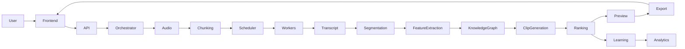
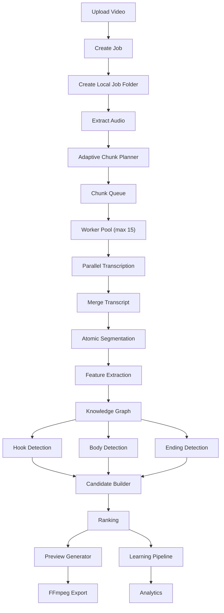
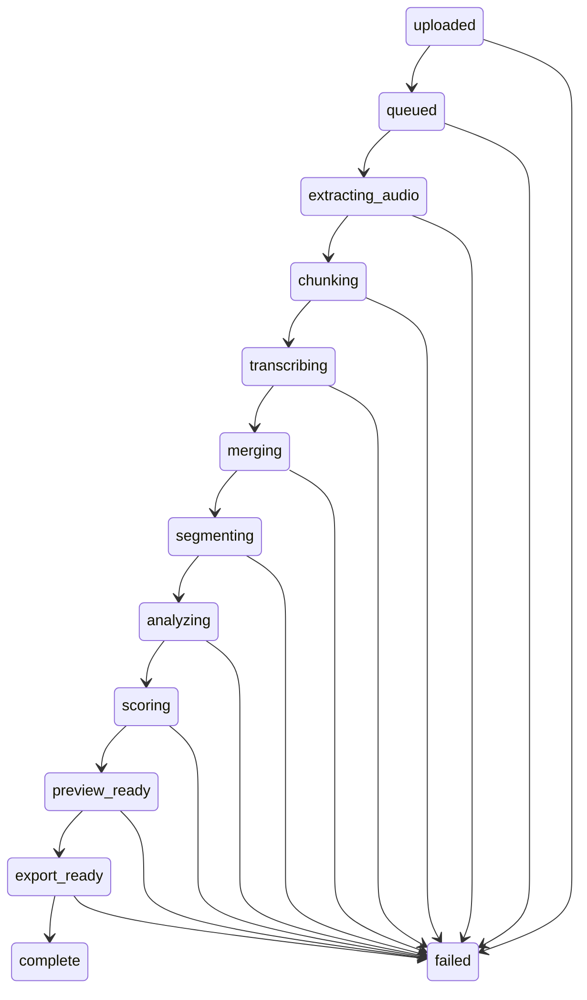
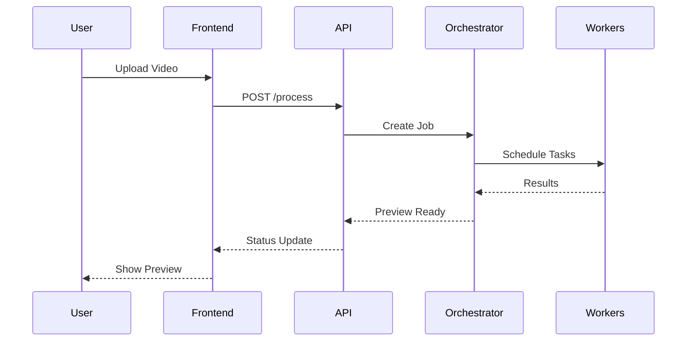

# 🎬 Trimora — AI Short Video Extraction Platform

> **Turn one long video into many high-quality short videos using an audio-first, highly parallel processing pipeline.**

---

# Overview

Trimora is an AI-powered backend and frontend platform that transforms podcasts, lectures, interviews, and long-form videos into engaging short-form clips.

The platform is designed around **speed**, **modularity**, **parallel execution**, and **future scalability**.

Core principles:

- 🎧 Audio-first processing
- ⚡ Parallel execution
- 🧩 Modular architecture
- 📂 Local storage first
- 🗄 Database-ready
- 🤖 Continuous learning
- 📈 Analytics driven

---

# Technology Stack

| Layer | Technology |
|---------|------------|
| Backend | Python |
| API | FastAPI |
| Frontend | React + TypeScript + Vite |
| Media | FFmpeg |
| Workers | asyncio Worker Pool |
| Storage | Local JSON + Files |
| Future Queue | Redis / Celery |
| Future Database | SQLite → PostgreSQL |

---

# High Level Architecture



---

# Complete Processing Pipeline



---

# Repository Layout

```text
project-root/
│
├── backend/
├── frontend/
├── shared/
├── storage/
├── docs/
├── scripts/
├── docker/
└── README.md
```

---

# Backend Layers

## API

Receives uploads and exposes REST endpoints.

- POST /api/process
- GET /api/status/{job_id}
- GET /api/preview/{job_id}
- GET /api/result/{job_id}
- POST /api/retry/{job_id}
- POST /api/cancel/{job_id}

---

## Orchestrator

Responsible for coordinating the complete workflow.

It never performs processing itself.

Responsibilities:

- create jobs
- update state
- launch workers
- coordinate production
- coordinate learning
- recover failures

---

## Worker System

Workers are completely stateless.

Each worker:

1. accepts one task
2. processes it
3. stores result
4. requests next task

Benefits:

- scalable
- memory efficient
- configurable
- future distributed execution

---

# Adaptive Chunking

Chunk sizes depend on:

- video duration
- speech density
- silence ratio
- processing target

Example

| Video Length | Chunk | Workers |
|--------------|--------|----------|
| <10 min | 30 sec | 5 |
| <1 hour | 45 sec | 10 |
| >1 hour | 90 sec | 15 |

---

# Job Lifecycle



---

# Storage Structure

```text
storage/jobs/job_id/

input/
audio/
transcript/
segments/
features/
graph/
clips/
learning/
analytics/
exports/

metadata.json
state.json
```

Each job is completely self-contained.

---

# Frontend Responsibilities

- Upload video
- Display progress
- Poll backend
- Show previews
- Show ranked clips
- Download exports
- Retry failed jobs

The frontend never performs processing.

---

# Learning Pipeline

Stores:

- accepted clips
- rejected clips
- feature vectors
- quality metrics
- pattern memory
- analytics

Runs independently of production.

---

# Analytics

Collected metrics:

- processing time
- chunk count
- worker utilization
- clip count
- failures
- quality scores

---

# Future Roadmap

- Redis Queue
- Celery Workers
- PostgreSQL
- GPU Inference
- Speaker Diarization
- Subtitle Generator
- Face Tracking
- Visual Scene Detection
- LLM-assisted Story Understanding
- Auto Thumbnail Generation

---

# Development Workflow



---

# Design Principles

- Separation of concerns
- Stateless workers
- Config-driven runtime
- Storage abstraction
- Database-ready architecture
- Event-driven pipeline
- Incremental persistence
- Preview-first UX
- Parallel processing
- Fault tolerance

---

# License

MIT License

---

# Author

Trimora Project

Designed as a scalable AI-powered short-video generation platform with clean architecture, modular services, bounded concurrency, adaptive chunking, and future-ready infrastructure.
