# Trimora V10.1

[](https://opensource.org/licenses/MIT)
[](https://www.python.org/downloads/)
[](https://fastapi.tiangolo.com/)
[](https://react.dev/)
[](https://ffmpeg.org/)
[]()
[]()

> AI-powered platform that transforms long-form videos into engaging short-form clips. V10.1 introduces a production-grade pipeline core with deterministic artifacts, immutable data, DAG execution, and pluggable strategies/objectives.

---

## Quick Navigation

- [Overview](#overview)
- [V10.1 Production Core](#v101-production-core)
- [Features](#features)
- [Tech Stack](#tech-stack)
- [Architecture](#architecture)
- [Execution Layer V2](#execution-layer-v2)
- [Semantic Enrichment Pipeline](#semantic-enrichment-pipeline)
- [Project Structure](#project-structure)
- [Production Pipeline](#production-pipeline)
- [Job Lifecycle](#job-lifecycle)
- [API Reference](#api-reference)
- [Ranking Engine](#ranking-engine)
- [Frontend](#frontend)
- [Configuration](#configuration)
- [Setup](#setup)
- [Docker](#docker)
- [Storage](#storage)
- [Testing](#testing)
- [License](#license)

---

## Overview

Trimora takes a long video (podcast, lecture, interview) and automatically extracts the best short-form clips. V10.1 rebuilds the pipeline core with production-grade guarantees: deterministic artifact IDs, immutable data types, DAG-based execution, automatic budget enforcement, and pluggable strategies and objectives.

**Processing time estimates** (with Faster-Whisper GPU transcription):

| Video Length | Chunks | Transcription | Semantic | Total |
|---|---|---|---|---|
| 8 minutes | 10 | ~10-20s | ~5s | ~25-40s |
| 30 minutes | 40 | ~40-80s | ~8s | ~60-100s |
| 1 hour | 80 | ~80-160s | ~15s | ~2-4 min |

**Processing time estimates** (with cloud transcription — Groq/Gemini):

| Video Length | Chunks | Transcription | Semantic | Total |
|---|---|---|---|---|
| 30 minutes | 40 | ~160s | ~8s | ~3 min |
| 1 hour | 40 | ~160s | ~8s | ~3 min |
| 3 hours | 120 | ~480s | ~20s | ~9 min |

---

## V10.1 Production Core

V10.1 introduces a complete pipeline execution core with 10 production-readiness guarantees. Every component is immutable, deterministic, and budget-enforced.

### Core Modules

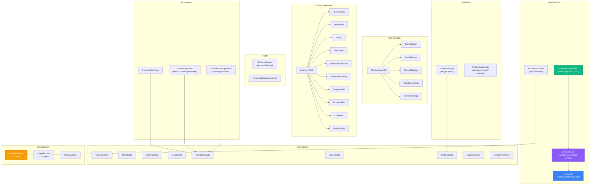

### 10 Production Guarantees

| # | Guarantee | Implementation |
|---|---|---|
| 1 | **Immutable data types** | All 9 data models use `frozen=True` |
| 2 | **Deterministic artifact IDs** | `generate_deterministic_id()` with `output_hash` parameter |
| 3 | **ExecutionContext not a God Object** | Split into `PipelineConfig`, `MetricsCollector`, `CacheStore`, `LoggerAdapter` |
| 4 | **Immutable PipelineContext** | `PipelineContext` is frozen, read-only |
| 5 | **DAG returns ExecutionResult** | Not `dict` — immutable result with trace, errors, latency stats |
| 6 | **Objective dependencies as DAG** | `ObjectiveRegistry` uses topological sort, not simple loop |
| 7 | **SimilarityProvider interface** | Not hardcoded Jaccard — pluggable via ABC |
| 8 | **Evaluation lifecycle states** | `EvaluationLifecycle`: GENERATED, REVIEWED, APPROVED, REJECTED, DEPLOYED |
| 9 | **Snapshots with full context** | `SnapshotV1` includes git commit, model versions, feature flags |
| 10 | **Automatic budget enforcement** | `BudgetEnforcer`: warning → count → disable → fallback |

### Pipeline Stage Budgets

| Stage | Budget | Warning | Description |
|---|---|---|---|
| adaptive_windows | 100ms | 80ms | Window splitting |
| signal_extraction | 200ms | 160ms | Audio/text signal extraction |
| evidence_compilation | 500ms | 400ms | Evidence graph compilation |
| graph_construction | 300ms | 240ms | Knowledge graph build |
| role_classification | 150ms | 120ms | Hook/body/ending classification |
| strategy_execution | 1000ms | 800ms | All clip strategies |
| candidate_deduplication | 100ms | 80ms | Similarity dedup |
| objective_scoring | 2000ms | 1600ms | All 10 objectives |
| narrative_optimization | 200ms | 160ms | Narrative flow sort |
| portfolio_optimization | 200ms | 160ms | MMR + diversity |
| evaluation_recording | 50ms | 40ms | Save evaluation records |
| **Total** | **5000ms** | — | Pipeline-wide budget |

---

## Features

| Feature | Description |
|---|---|
| Audio-First Processing | Extract audio once, process independently of video |
| Local Transcription | Faster-Whisper with auto model selection (tiny → large-v3) |
| Cloud Transcription | Groq/Gemini as fallback or primary provider |
| Per-Job Language Caching | Language detected once, reused across all chunks |
| Parallel Transcription | Rate-limited concurrent processing |
| Adaptive Chunking | Dynamic chunk sizes based on video duration |
| Execution Layer V2 | Provider-agnostic async engine with priority queuing |
| ProviderRouter | Thread-safe round-robin across multiple API keys/providers |
| Embedding Topic Clustering | sentence-transformers for adaptive block boundaries |
| LLM Semantic Enrichment | Pass 1: segment annotation, Pass 2: story boundary detection |
| Structured Summary | Global video summary as root semantic artifact |
| Block Synopses | Deterministic per-block summaries for debugging and reuse |
| Story Detection & Repair | Candidate formation, verification, and repair |
| Blueprint Generation | Story-to-blueprint conversion with cut selection |
| Multi-Stage Ranking | Semantic deduplication with MMR optimization |
| Deterministic Artifacts | Hash-based IDs with output_hash for true determinism |
| Immutable Data Types | All data models are frozen (immutable) |
| DAG Execution | Semaphore-controlled, priority-queued, budget-enforced |
| Pluggable Strategies | 5 built-in strategies (Story, Hook, Reveal, Reaction, Opinion) |
| Pluggable Objectives | 10 built-in scoring objectives with dependency DAG |
| Pipeline Snapshots | Git commit, model versions, feature flags at each stage |
| Evaluation Lifecycle | 5-state lifecycle: Generated → Reviewed → Approved → Rejected → Deployed |
| Checkpointing | Pass 1 and Pass 2 resume from last completed batch |
| FFmpeg Rendering | Direct MP4 clip export |
| Performance Monitoring | Per-chunk RTF logging and transcription analytics |
| Dark Theme UI | Modern React frontend with dark mode |

---

## Tech Stack

| Layer | Technology |
|---|---|
| Backend | Python 3.11+, FastAPI, Pydantic v2 |
| Pipeline Core | Custom DAG executor, frozen dataclasses, deterministic hashing |
| Frontend | React 18, TypeScript, Vite, Tailwind CSS |
| Media Processing | FFmpeg, ffprobe |
| Transcription | Faster-Whisper (local, CPU/GPU), Groq (cloud), Gemini (cloud) |
| Embeddings | sentence-transformers (all-MiniLM-L6-v2), TF-IDF fallback |
| LLM (Semantic) | Groq (Llama 3.1), Gemini — for Pass 1/2 semantic enrichment |
| Concurrency | asyncio worker pools with semaphore |
| Storage | Local JSON files (database-ready architecture) |
| Deployment | Docker Compose, Windows batch launcher |

---

## Architecture

### High-Level System Architecture

```mermaid
flowchart LR
    subgraph Frontend ["Frontend"]
        U["User"] --> FE["React SPA"]
    end

    subgraph Backend ["Backend"]
        FE -->|"POST /api/process"| API["FastAPI"]
        API --> ORC["Orchestrator"]
        ORC --> PIPE["Production Pipeline"]
    end

    subgraph Core ["Pipeline Core V10.1"]
        PIPE --> DAG["DAGExecutor"]
        DAG --> ART["Artifact[T]"]
        DAG --> BUD["BudgetEnforcer"]
        DAG --> TRACE["ExecutionResult"]
    end

    subgraph Ingestion ["Ingestion"]
        PIPE --> EXT["Audio Extraction"]
        EXT --> CHUNK["Chunk Planning"]
        CHUNK --> SCHED["Scheduler"]
    end

    subgraph Transcription ["Parallel Transcription"]
        SCHED --> WP["Worker Pool"]
        WP --> TRANS["Transcription"]
        TRANS -->|"local"| WM["WhisperManager"]
        WM --> FW["Faster-Whisper"]
        TRANS -->|"cloud"| GROQ["Groq API"]
        TRANS -->|"fallback"| GEMINI["Gemini API"]
        TRANS --> MERGE["Transcript Merge"]
    end

    subgraph Analysis ["Analysis"]
        MERGE --> SEG["Segmentation"]
        SEG --> FEAT["Feature Extraction"]
    end

    subgraph Semantic ["Semantic Enrichment"]
        FEAT --> EMB["Embedding Clustering"]
        EMB --> BLOCKS["Topic Blocks"]
        BLOCKS --> SYN["Block Synopses"]
        SYN --> SUM["Structured Summary"]
        SUM --> P1["Pass 1: Annotation"]
        P1 --> P2["Pass 2: Story Reasoning"]
        P2 --> SD["Story Detection"]
        SD --> SV["Story Validation"]
        SV --> BG["Blueprint Generation"]
    end

    subgraph Output ["Output"]
        FEAT --> RANK["Ranking Engine"]
        RANK --> PREV["Preview"]
        PREV --> RENDER["FFmpeg Render"]
    end

    style DAG fill:#8b5cf6,color:#fff,stroke:#7c3aed,stroke-width:2px
    style ART fill:#3b82f6,color:#fff,stroke:#2563eb,stroke-width:2px
    style BUD fill:#f59e0b,color:#fff,stroke:#d97706,stroke-width:2px
    style TRACE fill:#10b981,color:#fff,stroke:#059669,stroke-width:2px
```

### Data Flow

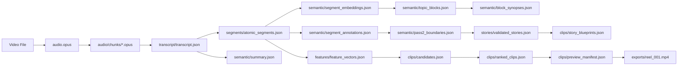

---

## Execution Layer V2

The Execution Layer V2 replaces service-driven LLM execution with a provider-agnostic engine.

### Architecture

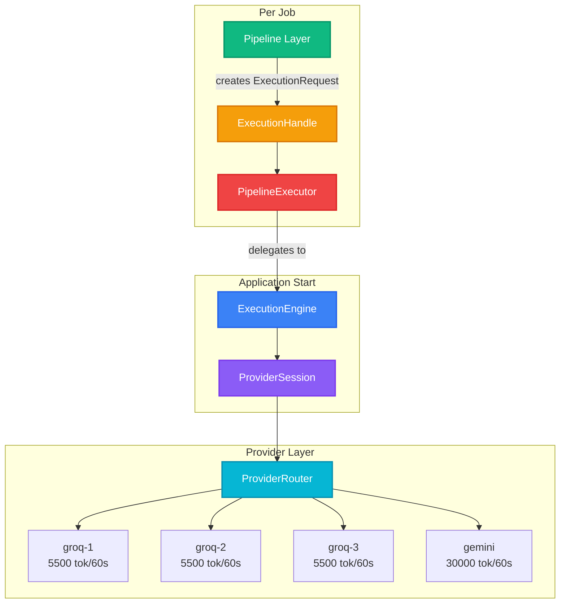

### Key Components

| Component | Location | Purpose |
|---|---|---|
| `ExecutionEngine` | `backend/execution/engine.py` | Generic task runner with priority queue, workers, retries, timeouts |
| `PipelineExecutor` | `backend/execution/engine.py` | Orchestrates pipeline stages |
| `ProviderSession` | `backend/execution/provider_session.py` | Rate limiting, token estimation, middleware chain |
| `AsyncRateLimiter` | `backend/execution/provider_session.py` | Sliding-window token bucket |
| `ProviderRouter` | `backend/services/llm_provider.py` | Thread-safe round-robin across multiple API keys/providers |
| `SegmentRepository` | `backend/execution/repository.py` | Read-only data access for prompt construction |
| `PromptBuilder` | `backend/execution/models.py` | Abstract base; each service implements its own |
| `PromptContext` | `backend/execution/models.py` | Lightweight, immutable context (IDs, not full objects) |
| `ExecutionProfiler` | `backend/execution/profiler.py` | Event-based timing and metrics collection |

### Request Flow

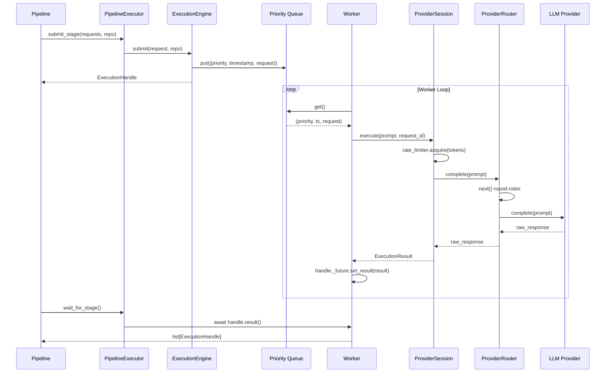

---

## Semantic Enrichment Pipeline

The semantic enrichment layer uses an **embedding-first architecture** that reduces LLM calls while improving quality.

### Pipeline Flow

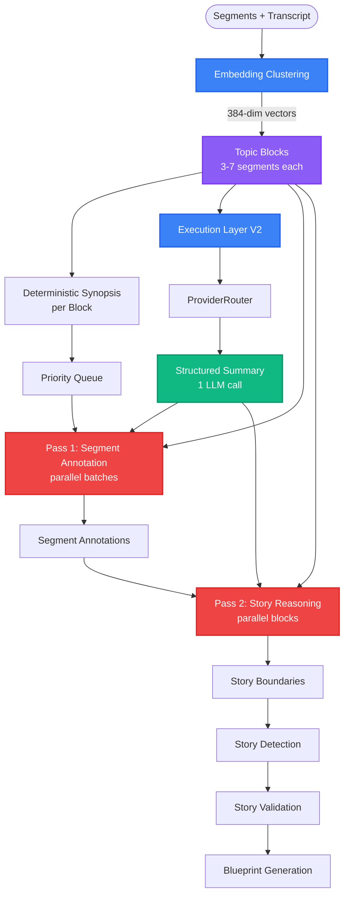

### Token Savings

| Metric | Before | After | Reduction |
|---|---|---|---|
| Pass 1 batches | 98 | 17 | 83% |
| Pass 2 batches | 20 | 5 | 75% |
| Total LLM calls | 118 | 23 | 81% |
| Total tokens | ~145K | ~35K | 76% |

---

## Project Structure

```text
trimora/
├── backend/
│   ├── main.py
│   ├── app/
│   │   ├── app.py
│   │   └── lifespan.py
│   ├── core/                          # V10.1 Pipeline Core
│   │   ├── __init__.py
│   │   ├── artifact.py                # Artifact[T], ErrorArtifact, ObjectiveResult
│   │   ├── context.py                 # ExecutionContext, PipelineContext (split concerns)
│   │   ├── dag.py                     # DAGExecutor, ExecutionResult, BudgetEnforcer
│   │   └── orchestrator.py            # PipelineOrchestrator, StageDefinition
│   ├── models/                        # V10.1 Data Models
│   │   ├── __init__.py
│   │   ├── data.py                    # 9 frozen data types
│   │   ├── clip.py                    # ClipCandidate, PortfolioClip, Portfolio
│   │   ├── reasoning.py               # Event, EventRole, Evidence, ClipHypothesis
│   │   ├── evaluation.py              # EvaluationRecord, EvaluationLifecycle
│   │   ├── feature.py
│   │   ├── generation_state.py
│   │   ├── graph.py
│   │   ├── job.py
│   │   ├── learning.py
│   │   ├── segment.py
│   │   ├── semantic.py
│   │   ├── story.py
│   │   ├── story_blueprint.py
│   │   ├── topic_block.py
│   │   └── transcript.py
│   ├── config/                        # V10.1 Configuration
│   │   ├── __init__.py
│   │   ├── settings.py                # PipelineSettings (frozen)
│   │   ├── budgets.py                 # StageBudget, STAGE_BUDGETS, check_budget()
│   │   ├── runtime.yaml
│   │   ├── thresholds.py
│   │   ├── ranking_config.py
│   │   ├── semantic_config.py
│   │   └── worker_limits.py
│   ├── services/                      # V10.1 Services
│   │   ├── __init__.py
│   │   ├── adaptive_windows.py        # AdaptiveWindowSplitter, WindowConfig
│   │   ├── roles.py                   # DynamicRoleClassifier
│   │   ├── snapshots.py               # PipelineSnapshotService, SnapshotV1
│   │   ├── audio_service.py
│   │   ├── whisper_manager.py
│   │   ├── transcription_service.py
│   │   ├── segmentation_service.py
│   │   ├── feature_service.py
│   │   ├── graph_service.py
│   │   ├── scoring_service.py
│   │   ├── embedding_service.py
│   │   ├── embedding_clusterer.py
│   │   ├── block_synopsis_generator.py
│   │   ├── priority_ranker.py
│   │   ├── transcript_summarizer.py
│   │   ├── semantic_service.py
│   │   ├── story_reasoner.py
│   │   ├── story_detector.py
│   │   ├── story_validator.py
│   │   ├── coverage_analyzer.py
│   │   ├── blueprint_generator.py
│   │   ├── duplicate_guard.py
│   │   ├── llm_provider.py
│   │   ├── preview_service.py
│   │   ├── rendering_service.py
│   │   └── storage_service.py
│   ├── strategies/                    # V10.1 Clip Strategies
│   │   ├── __init__.py
│   │   ├── base.py                    # ClipStrategy ABC
│   │   └── builtin.py                 # Story, Hook, Reveal, Reaction, Opinion
│   ├── objectives/                    # V10.1 Scoring Objectives
│   │   ├── __init__.py
│   │   ├── base.py                    # Objective ABC, ObjectiveMetadata
│   │   ├── registry.py                # ObjectiveRegistry (DAG execution)
│   │   └── builtin.py                 # 10 built-in objectives
│   ├── graph/                         # V10.1 Graph
│   │   ├── __init__.py
│   │   ├── evidence.py                # EvidenceGraph (window flattening)
│   │   └── persistent.py              # PersistentKnowledgeGraph
│   ├── optimization/                  # V10.1 Optimization
│   │   ├── __init__.py
│   │   ├── narrative.py               # NarrativeOptimizer
│   │   ├── portfolio.py               # PortfolioOptimizer, SimilarityProvider ABC
│   │   └── deduplication.py           # CandidateDeduplicationService
│   ├── evaluation/                    # V10.1 Evaluation
│   │   ├── __init__.py
│   │   └── layer.py                   # EvaluationLayer
│   ├── api/
│   │   └── routes/
│   ├── execution/                     # Execution Layer V2
│   │   ├── models.py
│   │   ├── provider_session.py
│   │   ├── repository.py
│   │   ├── engine.py
│   │   └── profiler.py
│   ├── ranking/
│   │   ├── pipeline.py
│   │   ├── models.py
│   │   └── *.py
│   ├── workers/
│   │   ├── scheduler.py
│   │   ├── worker_pool.py
│   │   └── *_worker.py
│   ├── storage/
│   │   ├── file_store.py
│   │   ├── job_store.py
│   │   └── state_store.py
│   ├── pipelines/
│   │   ├── production_pipeline.py
│   │   ├── orchestrator.py
│   │   └── event_bus.py
│   ├── contracts/
│   │   └── module_contracts.md
│   ├── tests/                         # 181 tests
│   │   ├── test_strategies.py         # 7 tests
│   │   ├── test_objectives.py         # 13 tests
│   │   ├── test_deduplication.py      # 6 tests
│   │   ├── test_evaluation.py         # 4 tests
│   │   ├── test_integration.py        # 2 tests (full pipeline)
│   │   └── unit/                      # ~149 existing tests
│   └── utils/
├── frontend/
│   └── src/
│       ├── app/
│       ├── pages/
│       ├── components/
│       ├── hooks/
│       ├── services/
│       ├── store/
│       ├── styles/
│       └── types/
├── shared/
├── docker/
├── storage/
├── docker-compose.yml
├── start.bat
├── smoke_test.py                      # Full pipeline smoke test
└── .env.example
```

---

## Production Pipeline

The pipeline processes videos through sequential stages with automatic budget enforcement, deterministic artifact tracking, and error handling between each stage.

```mermaid
flowchart TB
    START(["Start"]) --> CHK{"FFmpeg installed?"}
    CHK -->|"No"| FAIL1["Fail: ffmpeg not found"]
    CHK -->|"Yes"| EXT["Extract Audio"]

    EXT --> PLAN["Plan Chunks"]
    PLAN --> SPLIT["Split Audio Chunks"]

    SPLIT --> TRANS["Parallel Transcription"]
    TRANS --> RATE{"Rate Limit"}
    RATE -->|"Groq"| GROQ_CALL["Groq API"]
    RATE -->|"Fallback"| GEMINI_CALL["Gemini API"]

    GROQ_CALL --> MERGE["Merge Transcripts"]
    GEMINI_CALL --> MERGE

    MERGE --> SEG["Atomic Segmentation"]
    SEG --> FEAT["Feature Extraction"]
    FEAT --> GRAPH["Knowledge Graph"]

    GRAPH --> EMB["Embedding Clustering"]
    EMB --> BLOCKS["Topic Blocks"]
    BLOCKS --> SYN["Block Synopses"]

    BLOCKS --> EXEC_LAYER["Execution Layer V2"]
    EXEC_LAYER --> ROUTER2["ProviderRouter"]
    ROUTER2 --> SUM["Structured Summary"]
    SUM --> P1["Pass 1: Segment Annotation"]
    P1 --> P2["Pass 2: Story Reasoning"]

    P2 --> DET["Story Detection"]
    DET --> REPAIR["Story Repair"]
    REPAIR --> VALID["Story Validation"]
    VALID --> COV["Coverage Analysis"]
    COV --> BLUE["Blueprint Generation"]

    BLUE --> STRAT["Strategy Execution\n5 strategies"]
    STRAT --> DEDUP["Candidate Deduplication"]
    DEDUP --> OBJ["Objective Scoring\n10 objectives"]
    OBJ --> NARR["Narrative Optimization"]
    NARR --> PORT["Portfolio Optimization\nMMR + diversity"]
    PORT --> EVAL["Evaluation Recording"]

    EVAL --> PREV["Preview Manifest"]
    PREV --> EXPORT["Render MP4"]
    EXPORT --> LEARN["Analytics & Learning"]
    LEARN --> DONE(["Complete"])

    EXT -->|"Error"| FAIL2["Fail: extraction error"]
    TRANS -->|"Error"| FAIL3["Fail: transcription error"]

    style START fill:#10b981,color:#fff,stroke:#059669,stroke-width:2px
    style DONE fill:#10b981,color:#fff,stroke:#059669,stroke-width:2px
    style FAIL1 fill:#ef4444,color:#fff,stroke:#dc2626,stroke-width:2px
    style FAIL2 fill:#ef4444,color:#fff,stroke:#dc2626,stroke-width:2px
    style FAIL3 fill:#ef4444,color:#fff,stroke:#dc2626,stroke-width:2px
    style STRAT fill:#8b5cf6,color:#fff,stroke:#7c3aed,stroke-width:2px
    style DEDUP fill:#f59e0b,color:#fff,stroke:#d97706,stroke-width:2px
    style OBJ fill:#3b82f6,color:#fff,stroke:#2563eb,stroke-width:2px
    style NARR fill:#06b6d4,color:#fff,stroke:#0891b2,stroke-width:2px
    style PORT fill:#10b981,color:#fff,stroke:#059669,stroke-width:2px
    style EVAL fill:#f59e0b,color:#fff,stroke:#d97706,stroke-width:2px
```

### Pipeline Stages

| # | Stage | Budget | Description |
|---|---|---|---|
| 1 | FFmpeg Check | - | Verify ffmpeg/ffprobe are installed |
| 2 | Audio Extraction | - | Extract audio as OGG/Opus via FFmpeg |
| 3 | Chunk Planning | - | Calculate adaptive chunk sizes |
| 4 | Chunk Splitting | - | Split audio into chunk files |
| 5 | Transcription | - | Parallel transcription via Groq/Gemini |
| 6 | Merge | - | Deduplicate and merge transcripts |
| 7 | Segmentation | - | Split into atomic segments |
| 8 | Feature Extraction | - | Compute audio energy, text density, structure |
| 9 | Adaptive Windows | 100ms | Split into duration-based windows |
| 10 | Signal Extraction | 200ms | Extract audio/text signals |
| 11 | Evidence Compilation | 500ms | Build evidence graph |
| 12 | Graph Construction | 300ms | Build knowledge graph |
| 13 | Role Classification | 150ms | Hook/body/ending classification |
| 14 | Embedding Clustering | - | Group segments into topic blocks |
| 15 | Block Synopses | - | Generate deterministic synopses |
| 16 | Structured Summary | - | Global video summary via LLM |
| 17 | Pass 1 | - | Segment annotation (parallel batches) |
| 18 | Pass 2 | - | Story boundary detection (parallel) |
| 19 | Story Detection | - | Candidate formation and repair |
| 20 | Story Validation | - | Quality scoring and rejection |
| 21 | Blueprint Generation | - | Story-to-blueprint conversion |
| 22 | Strategy Execution | 1000ms | Run 5 clip strategies |
| 23 | Candidate Deduplication | 100ms | Similarity-based dedup |
| 24 | Objective Scoring | 2000ms | Score with 10 objectives (DAG order) |
| 25 | Narrative Optimization | 200ms | Sort for narrative flow |
| 26 | Portfolio Optimization | 200ms | MMR + diversity selection |
| 27 | Evaluation Recording | 50ms | Save evaluation records |
| 28 | Multi-Stage Ranking | - | 11-stage ranking engine |
| 29 | Preview | - | Build preview manifest |
| 30 | Export | - | Render top clip as MP4 |
| 31 | Learning | - | Save analytics and learning data |

---

## Job Lifecycle

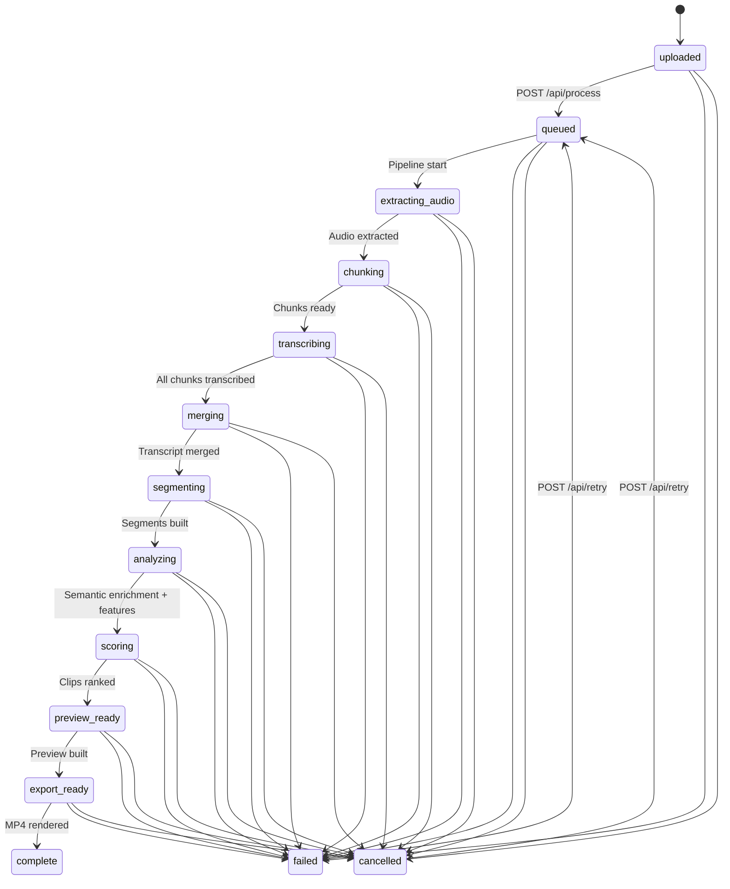

---

## API Reference

### Base URL

```
http://localhost:8000
```

### Endpoints

#### Health Check

```
GET /api/health
```

**Response:**
```json
{
  "status": "ok",
  "service": "trimora-backend"
}
```

---

#### Process Video

```
POST /api/process
Content-Type: multipart/form-data
```

**Parameters:**

| Name | Type | Required | Description |
|---|---|---|---|
| `file` | File | Yes | Video file (.mp4, .mov, .mkv, .webm, .m4v) |

**Constraints:**
- Max file size: 2 GB
- Allowed formats: `.mp4`, `.mov`, `.mkv`, `.webm`, `.m4v`

**Response:**
```json
{
  "job_id": "b7047bdb-53e4-4306-ae57-a2115316fc0c",
  "status": "uploaded",
  "progress": 0.0
}
```

**Errors:**
- `400` — Invalid file type or empty file
- `413` — File too large (over 2 GB)

---

#### Get Job Status

```
GET /api/status/{job_id}
```

**Parameters:**

| Name | Type | Location | Description |
|---|---|---|---|
| `job_id` | UUID | path | Job identifier |

**Response:**
```json
{
  "job_id": "b7047bdb-53e4-4306-ae57-a2115316fc0c",
  "status": "analyzing",
  "progress": 0.72,
  "created_at": "2026-07-03T12:00:00Z",
  "updated_at": "2026-07-03T12:01:30Z",
  "error": null,
  "preview_count": 0,
  "export_count": 0,
  "stats": null
}
```

**Errors:**
- `404` — Job not found

---

#### Get Preview

```
GET /api/preview/{job_id}
```

**Parameters:**

| Name | Type | Location | Description |
|---|---|---|---|
| `job_id` | UUID | path | Job identifier |

**Response:**
```json
{
  "job_id": "b7047bdb-53e4-4306-ae57-a2115316fc0c",
  "clips": [
    {
      "id": "clip_001",
      "title": "Opening Hook",
      "hook_start": 12.5,
      "hook_end": 18.2,
      "body_start": 18.2,
      "body_end": 45.0,
      "ending_start": 45.0,
      "ending_end": 52.3,
      "duration": 39.8,
      "total_score": 0.82,
      "status": "ready"
    }
  ]
}
```

---

#### Get Result

```
GET /api/result/{job_id}
```

**Response:**
```json
{
  "job": { "...job record..." },
  "preview": { "...preview manifest..." },
  "export_available": true,
  "export_path": "storage/jobs/<id>/exports/reel_001.mp4"
}
```

---

#### Retry Job

```
POST /api/retry/{job_id}
```

Retries a failed or cancelled job from the beginning.

**Response:**
```json
{
  "job_id": "b7047bdb-53e4-4306-ae57-a2115316fc0c",
  "status": "queued"
}
```

---

#### Cancel Job

```
POST /api/cancel/{job_id}
```

Cancels a running job. The pipeline checks for cancellation between each stage.

**Response:**
```json
{
  "job_id": "b7047bdb-53e4-4306-ae57-a2115316fc0c",
  "status": "cancelled"
}
```

---

#### Export / Check Export

```
POST /api/export/{job_id}
```

Triggers or checks export readiness.

**Response:**
```json
{
  "job_id": "b7047bdb-53e4-4306-ae57-a2115316fc0c",
  "export_path": "storage/jobs/<id>/exports/reel_001.mp4"
}
```

---

#### Download Export

```
GET /api/download/{job_id}
```

Downloads the rendered MP4 file.

**Response:** Binary file download (`video/mp4`)

**Filename:** `trimora_reel_001.mp4`

**Errors:**
- `404` — Export not found

---

### API Flow

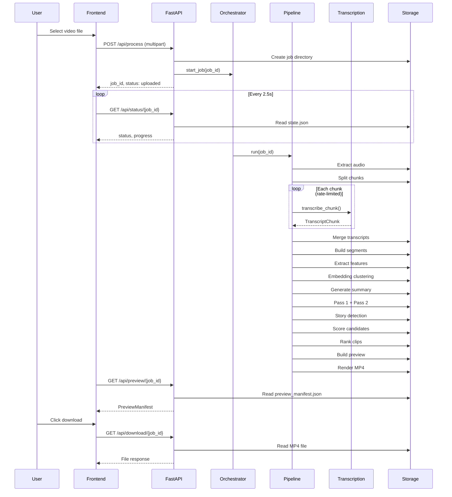

---

## Fallback Mechanisms

Trimora implements graceful degradation at multiple levels.

### Transcription Provider Fallback

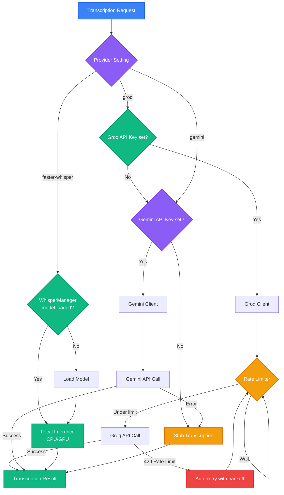

| Priority | Provider | Model | Fallback Trigger |
|---|---|---|---|
| 1 (Primary) | Faster-Whisper | auto (tiny → large-v3) | Model not installed, GPU unavailable |
| 2 (Fallback) | Groq | whisper-large-v3-turbo | API key missing, rate limit exceeded |
| 3 (Fallback) | Gemini | gemini-2.0-flash | API key missing, API error |
| 4 (Stub) | Local | Generated text | No API keys configured |

### Embedding Fallback

| Priority | Method | Model | Fallback Trigger |
|---|---|---|---|
| 1 (Primary) | Sentence-transformers | all-MiniLM-L6-v2 | Library not installed |
| 2 (Fallback) | TF-IDF | Hash-based 384-dim | Always available |

### LLM Provider Fallback (Semantic Enrichment)

| Priority | Provider | Model | Fallback Trigger |
|---|---|---|---|
| 1 (Primary) | Groq | Llama 3.1 | API key missing, rate limit |
| 2 (Fallback) | Gemini | gemini-2.0-flash | API key missing |
| 3 (Rule-based) | Local | Heuristic | No API keys configured |

#### ProviderRouter (Multi-Key Load Balancing)

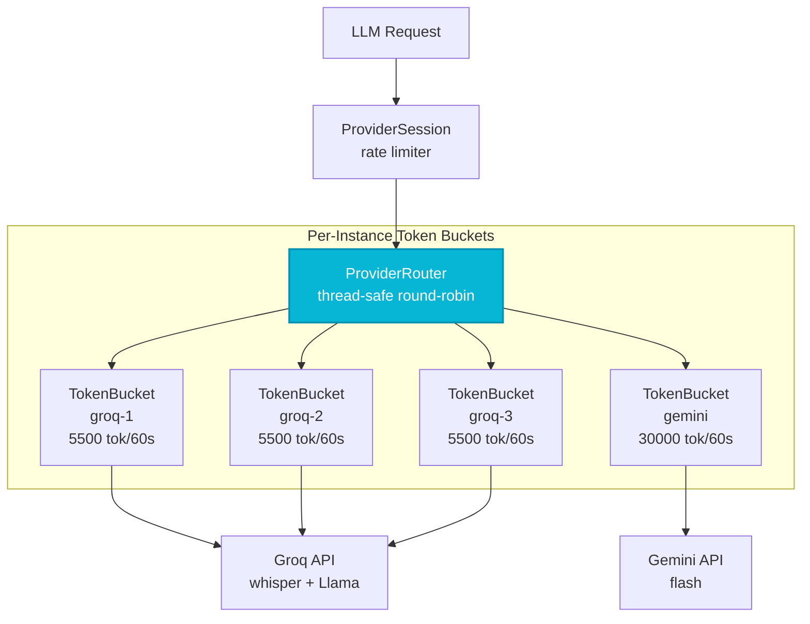

**Configuration** — each key on its own line in `.env`:
```bash
GROQ_API_KEY_1=gsk_abc123...
GROQ_API_KEY_2=gsk_def456...
GROQ_API_KEY_3=gsk_ghi789...
GEMINI_API_KEY=AIza...
```

---

## Ranking Engine

The ranking engine uses multiple stages to score and select the best clips.


### Scoring Formula

```
total_score = hook_score * 0.35 + body_score * 0.25 + ending_score * 0.20 + flow_score * 0.20
```

### Ranking Stages

| Stage | Module | Purpose |
|---|---|---|
| 1 | `hard_constraints.py` | Filter: duration 15-90s, chronological order, max 30s gap |
| 2 | `narrative.py` | Semantic coherence via embedding similarity |
| 3 | `context.py` | Contextual coherence: pronoun consistency, shared nouns |
| 4 | `hook_quality.py` | Hook effectiveness: duration, questions, curiosity words |
| 5 | `density.py` | Information density: words/sec, specificity bonuses |
| 6 | `retention.py` | Viewer retention prediction: CTA, flow, duration |
| 7 | `novelty.py` | Semantic deduplication via cosine similarity (threshold 0.75) |
| 8 | `tie_breaker.py` | Tie-breaking: confidence > hook > duration > position |
| 9 | `confidence.py` | Confidence scoring: audio source, feature completeness |
| 10 | `explanation.py` | Human-readable ranking explanations |
| 11 | `optimizer.py` | MMR optimization: quality (0.7) + diversity (0.3) |

### Segment Classification

| Type | Detection Method | Example Patterns |
|---|---|---|
| **Hook** | First sentence + pattern match | "What if...", "Did you know...", "Imagine..." |
| **Body** | Default for middle sentences | (any text) |
| **Ending** | Last sentence + pattern match | "So that's why...", "Subscribe...", "Thanks for watching..." |

---

## Frontend

The frontend is a **React SPA** with 5 pages and a dark-themed UI.

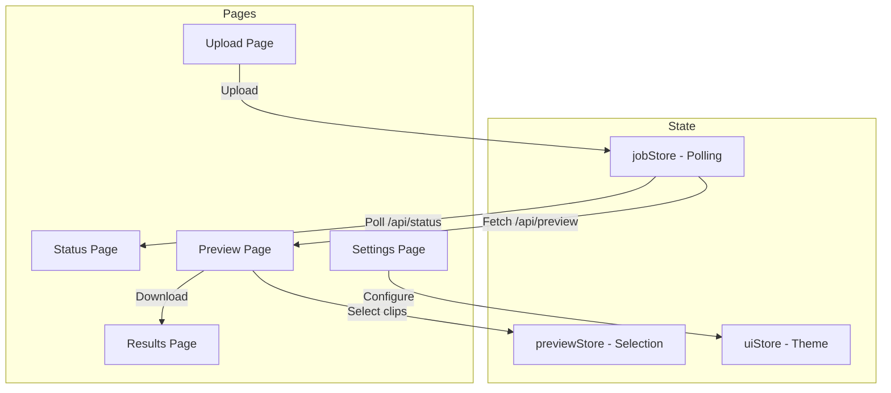

### Pages

| Page | Route | Purpose |
|---|---|---|
| Upload | `/upload` | File picker, drag-and-drop upload |
| Status | `/status` | Progress timeline, job summary, retry/cancel |
| Preview | `/preview` | Clip grid with scores, export button |
| Results | `/results` | Final output, clip list, download |
| Settings | `/settings` | API base URL configuration |

### State Management

| Store | Hook | Purpose |
|---|---|---|
| `jobStore` | `useJobState()` | Job ID, status, preview, polling (2.5s interval) |
| `previewStore` | `usePreviewSelection()` | Clip selection toggle |
| `uiStore` | `useUiState()` | Theme, API base URL |

---

## Configuration

### Environment Variables

```bash
# Storage
TRIMORA_STORAGE_ROOT=./storage
TRIMORA_JOBS_ROOT=./storage/jobs

# Workers
TRIMORA_MAX_TRANSCRIPTION_WORKERS=5
TRIMORA_MAX_FEATURE_WORKERS=15
TRIMORA_MAX_CLIP_WORKERS=8

# Chunking
TRIMORA_MIN_CHUNK_SECONDS=30
TRIMORA_MAX_CHUNK_SECONDS=120
TRIMORA_OVERLAP_SECONDS=2

# Transcription
TRIMORA_TRANSCRIPTION_PROVIDER=faster-whisper
TRIMORA_TRANSCRIPTION_TIMEOUT=600

# Local Transcription (Faster-Whisper)
WHISPER_MODEL_SIZE=auto
WHISPER_DEVICE=cuda
WHISPER_COMPUTE_TYPE=auto
WHISPER_BEAM_SIZE=5
WHISPER_VAD_FILTER=true
WHISPER_LANGUAGE=null

# CORS
TRIMORA_CORS_ORIGINS=*

# Frontend
VITE_API_BASE_URL=http://localhost:8000

# API Keys (required for cloud transcription)
GROQ_API_KEY_1=gsk_...
GROQ_API_KEY_2=gsk_...
GROQ_API_KEY_3=gsk_...
GEMINI_API_KEY=AIza...
```

### Runtime Configuration

Settings are loaded in order: defaults → `runtime.yaml` → environment variables.

```yaml
# backend/config/runtime.yaml
workers:
  max_transcription_workers: 15
  max_feature_workers: 15
  max_clip_workers: 8

chunking:
  min_seconds: 30
  max_seconds: 120
  overlap_seconds: 2
  bitrate: "64k"
  keep_chunks: true

storage:
  root: ./storage
  jobs_root: ./storage/jobs

job:
  retry_count: 3
  transcription_provider: "faster-whisper"
  transcription_timeout_seconds: 600
  export_timeout_seconds: 600

whisper:
  model_size: "auto"
  device: "cuda"
  compute_type: "auto"
  beam_size: 5
  language: null
  vad_filter: true
  vad_min_silence_ms: 500

thresholds:
  min_segment_seconds: 1.2
  min_candidate_score: 0.35
  preview_top_k: 20

semantic:
  batch_size: 10
  context_overlap: 2
  batch_delay_seconds: 0.0
```

---

## Setup

### Prerequisites

- Python 3.11+
- Node.js 18+
- FFmpeg (in PATH)
- At least one transcription API key (Groq or Gemini)

### Quick Start (Windows)

```bash
git clone https://github.com/yourusername/trimora.git
cd trimora
copy .env.example .env
# Edit .env with your API keys
start.bat
```

### Manual Setup

```bash
# Backend
cd backend
python -m venv .venv
.venv\Scripts\activate
pip install -r requirements.txt

# Frontend
cd frontend
npm install

# Start backend (port 8000)
cd ../backend
uvicorn main:app --reload --host 0.0.0.0 --port 8000

# Start frontend (port 5173)
cd ../frontend
npm run dev
```

### Transcription Setup

#### Local Transcription (Faster-Whisper)

No API keys required. Faster-Whisper runs locally on your machine with GPU acceleration.

```bash
pip install faster-whisper
TRIMORA_TRANSCRIPTION_PROVIDER=faster-whisper
WHISPER_MODEL_SIZE=auto
WHISPER_DEVICE=cuda
WHISPER_COMPUTE_TYPE=auto
```

#### Cloud Transcription (Groq/Gemini)

Requires API keys. Faster than local on CPU, but requires internet connection.

```bash
TRIMORA_TRANSCRIPTION_PROVIDER=groq
GROQ_API_KEY_1=gsk_...
GROQ_API_KEY_2=gsk_...
GEMINI_API_KEY=AIza...
```

---

## Docker

### Docker Compose

```bash
docker-compose up --build
```

- Backend: `http://localhost:8000`
- Frontend: `http://localhost:3000`

### Services

| Service | Port | Description |
|---|---|---|
| backend | 8000 | FastAPI + FFmpeg |
| frontend | 3000 | Nginx + React build |

### Dockerfiles

- `docker/Dockerfile.backend` — Python 3.11-slim + FFmpeg
- `docker/Dockerfile.frontend` — Multi-stage: Node 20 build + Nginx serve

---

## Storage

Each job is self-contained in `storage/jobs/{job_id}/`:

```text
storage/jobs/{job_id}/
├── input/
├── audio/
│   ├── audio.opus
│   └── chunks/
├── transcript/
│   ├── transcript.json
│   └── words.json
├── segments/
│   └── atomic_segments.json
├── features/
│   └── feature_vectors.json
├── graph/
│   └── local_graph.json
├── semantic/
│   ├── segment_embeddings.json
│   ├── topic_blocks.json
│   ├── block_synopses.json
│   ├── block_embeddings.json
│   ├── priority_queue.json
│   ├── summary.json
│   ├── segment_annotations.json
│   ├── pass1_checkpoint.jsonl
│   ├── pass1_raw.json
│   ├── pass2_checkpoint.jsonl
│   └── pass2_raw.json
├── stories/
│   ├── story_candidates.json
│   └── validated_stories.json
├── clips/
│   ├── candidates.json
│   ├── story_blueprints.json
│   ├── ranked_clips.json
│   ├── preview_manifest.json
│   └── generation_state.json
├── evaluations/
│   └── eval_*.json
├── snapshots/
│   └── *.json
├── learning/
├── analytics/
├── exports/
│   └── reel_001.mp4
├── state.json
└── metadata.json
```

---

## Testing

```bash
# Run all tests (181 tests)
python -m pytest backend/tests/ -v

# Run V10.1 pipeline core tests (31 tests)
python -m pytest backend/tests/test_strategies.py backend/tests/test_objectives.py backend/tests/test_deduplication.py backend/tests/test_evaluation.py backend/tests/test_integration.py -v

# Run existing unit tests only
python -m pytest backend/tests/unit/ -v

# Run with coverage
python -m pytest backend/tests/ --cov=backend --cov-report=term-missing
```

### Test Summary

| Category | Files | Tests | Description |
|---|---|---|---|
| V10.1 Pipeline Core | 5 | 31 | Strategies, objectives, dedup, evaluation, integration |
| Existing Unit Tests | 18 | ~144 | Original pipeline tests |
| **Total** | **23** | **~181** | |

### Smoke Test

```bash
# Full pipeline smoke test (verifies all 10 production guarantees)
python smoke_test.py
```

Expected output: 11 components executed, 10 production fixes verified, 83ms total time, 2 candidates scored.

---

## License

This project is licensed under the **MIT License** — see the [LICENSE](LICENSE) file for details.

```
MIT License — Copyright (c) 2026 Trimora
```
