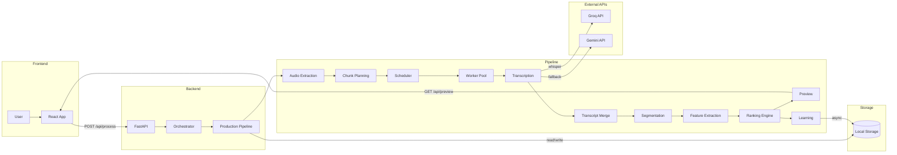
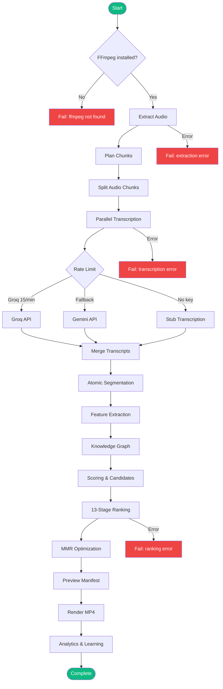
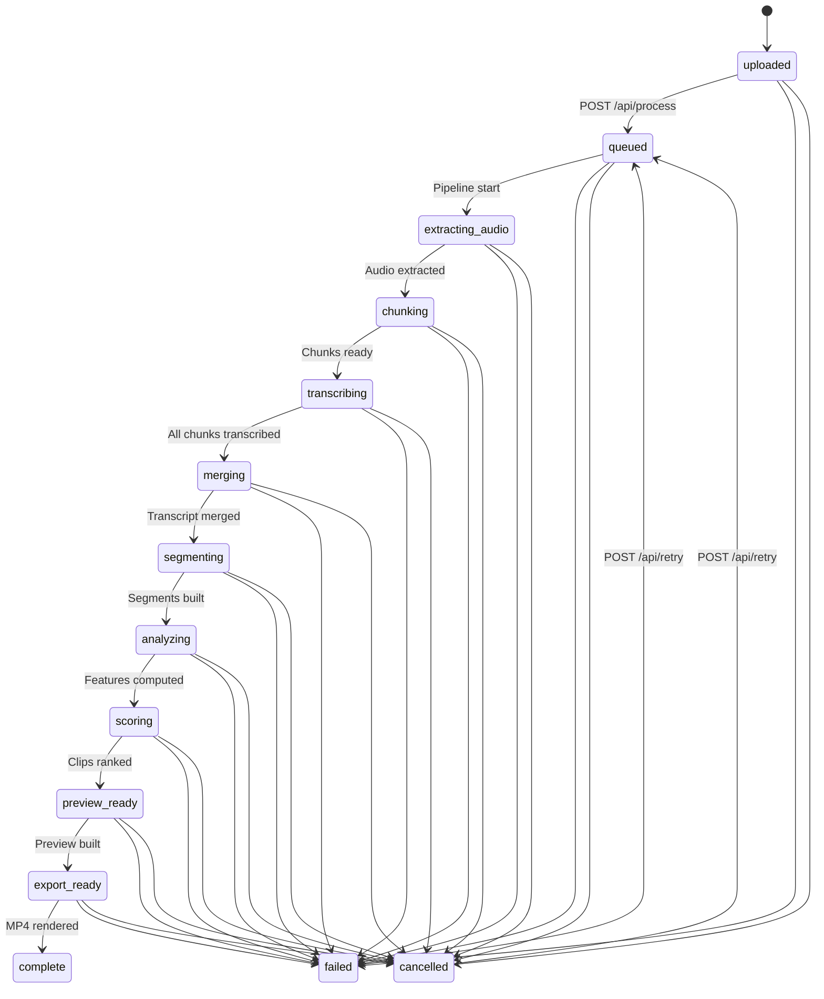
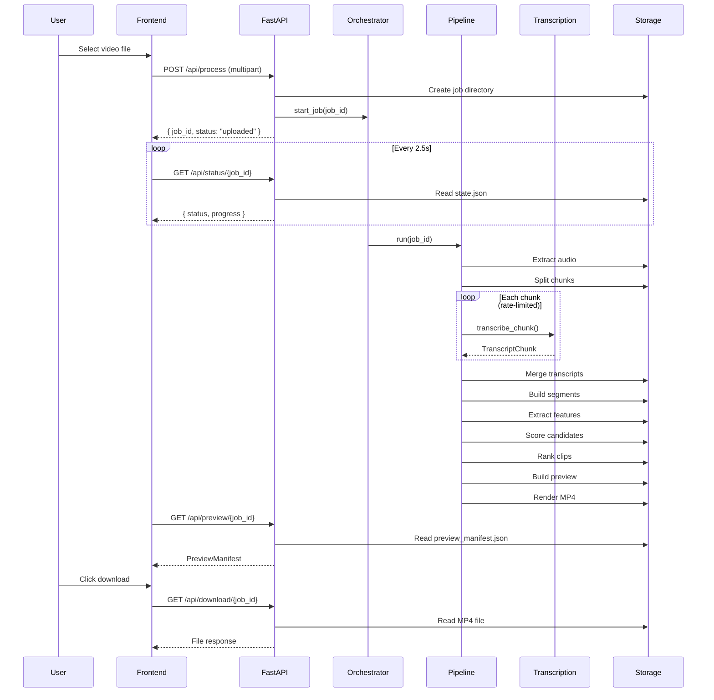
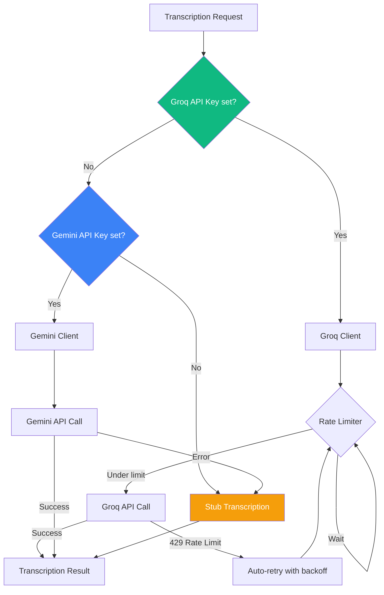
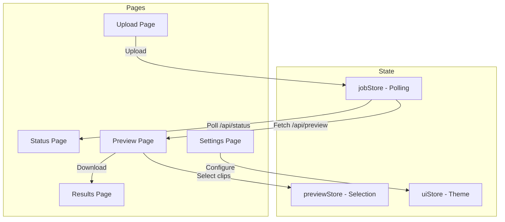

# Trimora

> AI-powered platform that transforms long-form videos into engaging short-form clips using an audio-first, highly parallel processing pipeline.

---

## Table of Contents

- [Overview](#overview)
- [Features](#features)
- [Tech Stack](#tech-stack)
- [Architecture](#architecture)
- [Project Structure](#project-structure)
- [Pipeline](#pipeline)
- [Job Lifecycle](#job-lifecycle)
- [API Reference](#api-reference)
- [Fallback Mechanisms](#fallback-mechanisms)
- [Ranking Engine](#ranking-engine)
- [Frontend](#frontend)
- [Configuration](#configuration)
- [Setup](#setup)
- [Docker](#docker)
- [Storage](#storage)
- [License](#license)

---

## Overview

Trimora takes a long video (podcast, lecture, interview) and automatically extracts the best short-form clips. The pipeline processes audio independently of video, using parallel transcription, multi-signal feature extraction, semantic embeddings, and a 13-stage ranking engine to identify the most engaging moments.

**Processing time estimates** (with rate-limited transcription):

| Video Length | Chunks | Transcription | Total |
|---|---|---|---|
| 30 minutes | 40 | ~160s | ~3 min |
| 1 hour | 40 | ~160s | ~3 min |
| 3 hours | 120 | ~480s | ~9 min |
| 4 hours | 160 | ~640s | ~12 min |

---

## Features

- Audio-first processing (extract audio once, process independently)
- Parallel transcription with rate limiting (Groq/Gemini)
- Adaptive chunking based on video duration and speech density
- Multi-signal feature extraction (audio energy, text density, structure, patterns)
- 13-stage ranking engine with semantic deduplication
- MMR-based global optimization for clip diversity
- FFmpeg-based clip rendering
- Learning pipeline for continuous improvement
- Real-time progress tracking via polling
- Dark-themed React frontend

---

## Tech Stack

| Layer | Technology |
|---|---|
| Backend | Python 3.11+, FastAPI, Pydantic |
| Frontend | React 18, TypeScript, Vite, Tailwind CSS |
| Media Processing | FFmpeg, ffprobe |
| Transcription | Groq (whisper-large-v3-turbo), Google Gemini (gemini-2.0-flash) |
| Embeddings | sentence-transformers/all-MiniLM-L6-v2, TF-IDF fallback |
| Concurrency | asyncio worker pools with semaphore |
| Storage | Local JSON files (database-ready architecture) |
| Deployment | Docker Compose, Windows batch launcher |

---

## Architecture



---

## Project Structure

```text
trimora/
├── backend/
│   ├── main.py                     # Uvicorn entry point
│   ├── app/
│   │   ├── app.py                  # FastAPI app factory
│   │   └── lifespan.py            # Startup/shutdown lifecycle
│   ├── api/
│   │   ├── routes/
│   │   │   ├── process.py          # POST /api/process
│   │   │   ├── status.py           # GET /api/status/{job_id}
│   │   │   ├── preview.py          # GET /api/preview/{job_id}
│   │   │   └── export.py           # Result, retry, cancel, export, download
│   │   └── middleware/
│   │       ├── cors.py             # CORS configuration
│   │       ├── errors.py           # Global error handler
│   │       └── logging.py          # Request timing
│   ├── config/
│   │   ├── settings.py             # Settings dataclass + YAML loader
│   │   ├── runtime.yaml            # Runtime configuration
│   │   ├── thresholds.py           # Scoring thresholds
│   │   ├── ranking_config.py       # Ranking engine parameters
│   │   └── worker_limits.py        # Worker pool limits
│   ├── models/                     # Pydantic data models
│   ├── services/                   # Business logic services
│   ├── pipelines/                  # Processing pipelines
│   ├── workers/                    # Async worker pools
│   ├── ranking/                    # 13-stage ranking engine
│   ├── storage/                    # File-based persistence
│   └── utils/                      # Utility functions
├── frontend/
│   └── src/
│       ├── app/                    # App shell and router
│       ├── pages/                  # 5 page components
│       ├── components/             # Reusable UI components
│       ├── services/               # API client services
│       ├── store/                  # State management
│       └── types/                  # TypeScript types
├── shared/                         # Shared schemas, types, contracts
├── docker/                         # Dockerfiles
├── storage/                        # Runtime job data (gitignored)
├── docker-compose.yml
├── start.bat                       # Windows launcher
└── .env.example                    # Environment template
```

---

## Pipeline

The production pipeline processes videos through 12 sequential stages. Each stage has cancellation checks and error handling.



### Pipeline Stages

| # | Stage | Status | Progress | Description |
|---|---|---|---|---|
| 1 | FFmpeg Check | - | - | Verify ffmpeg/ffprobe are installed |
| 2 | Audio Extraction | `extracting_audio` | 5% | Extract audio as OGG/Opus via FFmpeg |
| 3 | Chunk Planning | `chunking` | 10% | Calculate adaptive chunk sizes |
| 4 | Chunk Splitting | `chunking` | 10-20% | Split audio into chunk files |
| 5 | Transcription | `transcribing` | 20-45% | Parallel transcription via Groq/Gemini |
| 6 | Merge | `merging` | 45% | Deduplicate and merge transcripts |
| 7 | Segmentation | `segmenting` | 58% | Split into atomic segments, classify hooks/body/endings |
| 8 | Feature Extraction | `analyzing` | 70% | Compute audio energy, text density, structure, patterns |
| 9 | Knowledge Graph | `analyzing` | 70% | Build segment relationship graph |
| 10 | Scoring | `scoring` | 80% | Generate and score clip candidates |
| 11 | Ranking | `scoring` | 80% | 13-stage ranking with MMR optimization |
| 12 | Preview | `preview_ready` | 90% | Build preview manifest |
| 13 | Export | `export_ready` | 95% | Render top clip as MP4 |
| 14 | Learning | `complete` | 100% | Save analytics and learning data |

---

## Job Lifecycle



---

## API Reference

### Base URL

```
http://localhost:8000
```

### Endpoints

#### Health Check

```
GET /api/health
```

**Response:**
```json
{
  "status": "ok",
  "service": "trimora-backend"
}
```

---

#### Process Video

```
POST /api/process
Content-Type: multipart/form-data
```

**Parameters:**

| Name | Type | Required | Description |
|---|---|---|---|
| `file` | File | Yes | Video file (.mp4, .mov, .mkv, .webm, .m4v) |

**Constraints:**
- Max file size: 2 GB
- Allowed formats: `.mp4`, `.mov`, `.mkv`, `.webm`, `.m4v`

**Response:**
```json
{
  "job_id": "b7047bdb-53e4-4306-ae57-a2115316fc0c",
  "status": "uploaded",
  "progress": 0.0
}
```

**Errors:**
- `400` - Invalid file type or empty file
- `413` - File too large (over 2 GB)

---

#### Get Job Status

```
GET /api/status/{job_id}
```

**Parameters:**

| Name | Type | Location | Description |
|---|---|---|---|
| `job_id` | UUID | path | Job identifier |

**Response:**
```json
{
  "job_id": "b7047bdb-53e4-4306-ae57-a2115316fc0c",
  "status": "transcribing",
  "progress": 0.35,
  "created_at": "2026-07-03T12:00:00Z",
  "updated_at": "2026-07-03T12:01:30Z",
  "error": null,
  "preview_count": 0,
  "export_count": 0,
  "stats": null
}
```

**Errors:**
- `404` - Job not found

---

#### Get Preview

```
GET /api/preview/{job_id}
```

**Parameters:**

| Name | Type | Location | Description |
|---|---|---|---|
| `job_id` | UUID | path | Job identifier |

**Response:**
```json
{
  "job_id": "b7047bdb-53e4-4306-ae57-a2115316fc0c",
  "clips": [
    {
      "id": "clip_001",
      "title": "Opening Hook",
      "hook_start": 12.5,
      "hook_end": 18.2,
      "body_start": 18.2,
      "body_end": 45.0,
      "ending_start": 45.0,
      "ending_end": 52.3,
      "duration": 39.8,
      "total_score": 0.82,
      "status": "ready",
      "transcript_snippet": "Did you know that most people...",
      "hook_score": 0.9,
      "body_score": 0.75,
      "ending_score": 0.7,
      "flow_score": 0.85
    }
  ]
}
```

**Errors:**
- `404` - Preview not ready or job not found

---

#### Get Result

```
GET /api/result/{job_id}
```

**Response:**
```json
{
  "job": { "...job record..." },
  "preview": { "...preview manifest..." },
  "export_available": true,
  "export_path": "storage/jobs/<id>/exports/reel_001.mp4"
}
```

---

#### Retry Job

```
POST /api/retry/{job_id}
```

Retries a failed or cancelled job from the beginning.

**Response:**
```json
{
  "job_id": "b7047bdb-53e4-4306-ae57-a2115316fc0c",
  "status": "queued"
}
```

---

#### Cancel Job

```
POST /api/cancel/{job_id}
```

Cancels a running job. The pipeline checks for cancellation between each stage.

**Response:**
```json
{
  "job_id": "b7047bdb-53e4-4306-ae57-a2115316fc0c",
  "status": "cancelled"
}
```

---

#### Export / Check Export

```
POST /api/export/{job_id}
```

Triggers or checks export readiness.

**Response:**
```json
{
  "job_id": "b7047bdb-53e4-4306-ae57-a2115316fc0c",
  "export_path": "storage/jobs/<id>/exports/reel_001.mp4"
}
```

---

#### Download Export

```
GET /api/download/{job_id}
```

Downloads the rendered MP4 file.

**Response:** Binary file download (`video/mp4`)

**Filename:** `trimora_reel_001.mp4`

**Errors:**
- `404` - Export not found

---

### API Flow Diagram



---

## Fallback Mechanisms

Trimora implements graceful degradation at multiple levels. If a higher-priority component is unavailable, the system automatically falls back to alternatives.

### Transcription Provider Fallback



| Priority | Provider | Model | Fallback Trigger |
|---|---|---|---|
| 1 (Primary) | Groq | whisper-large-v3-turbo | API key missing, rate limit exceeded |
| 2 (Fallback) | Gemini | gemini-2.0-flash | API key missing, API error |
| 3 (Stub) | Local | Generated text | No API keys configured |

**Rate Limiting:** Groq requests are rate-limited to 15 req/min with a 4-second minimum gap between requests to stay under the free tier limit (20 RPM).

### Embedding Fallback

| Priority | Method | Model | Fallback Trigger |
|---|---|---|---|
| 1 (Primary) | Sentence-transformers | all-MiniLM-L6-v2 | Library not installed |
| 2 (Fallback) | TF-IDF | Hash-based 384-dim | Always available |

### Audio Analysis Fallback

| Priority | Method | Description | Fallback Trigger |
|---|---|---|---|
| 1 (Primary) | FFmpeg astats | Real RMS audio energy | FFmpeg unavailable |
| 2 (Fallback) | Text length | Heuristic based on segment duration | Always available |

### Transcription Fallback Detail

```python
# From transcription_service.py
class TranscriptionService:
    def __init__(self):
        if provider == "groq":
            self._groq = _build_groq_client()
            if self._groq is None:
                self._gemini = _build_gemini_client()  # Fallback
        elif provider == "gemini":
            self._gemini = _build_gemini_client()
            if self._gemini is None:
                self._groq = _build_groq_client()  # Fallback

    async def transcribe_chunk(self, chunk_id, chunk_path, start, end):
        if self._rate_limiter:
            await self._rate_limiter.acquire()  # Rate limit
        return await asyncio.to_thread(self._transcribe_sync, ...)

    def _transcribe_sync(self, ...):
        if self._groq:
            return _groq_transcribe(...)  # Primary
        if self._gemini:
            return _gemini_transcribe(...)  # Fallback
        return _stub_transcribe(...)  # Last resort
```

---

## Ranking Engine

The ranking engine uses 13 stages to score and select the best clips.


### Scoring Formula

```
total_score = hook_score * 0.35 + body_score * 0.25 + ending_score * 0.20 + flow_score * 0.20
```

### Ranking Stages

| Stage | Module | Purpose |
|---|---|---|
| 1 | `hard_constraints.py` | Filter: duration 15-90s, chronological order, max 30s gap |
| 2 | `narrative.py` | Semantic coherence via embedding similarity |
| 3 | `context.py` | Contextual coherence: pronoun consistency, shared nouns |
| 4 | `hook_quality.py` | Hook effectiveness: duration, questions, curiosity words |
| 5 | `density.py` | Information density: words/sec, specificity bonuses |
| 6 | `retention.py` | Viewer retention prediction: CTA, flow, duration |
| 7 | `novelty.py` | Semantic deduplication via cosine similarity (threshold 0.75) |
| 8 | `tie_breaker.py` | Tie-breaking: confidence > hook > duration > position |
| 9 | `confidence.py` | Confidence scoring: audio source, feature completeness |
| 10 | `explanation.py` | Human-readable ranking explanations |
| 11 | `optimizer.py` | MMR optimization: quality (0.7) + diversity (0.3) |

### Segment Classification

Segments are classified into three types using regex patterns and positional heuristics:

| Type | Detection Method | Example Patterns |
|---|---|---|
| **Hook** | First sentence + pattern match | "What if...", "Did you know...", "Imagine..." |
| **Body** | Default for middle sentences | (any text) |
| **Ending** | Last sentence + pattern match | "So that's why...", "Subscribe...", "Thanks for watching..." |

---

## Frontend

The frontend is a React SPA with 5 pages and a dark-themed UI.



### Pages

| Page | Route | Purpose |
|---|---|---|
| Upload | `/upload` | File picker, drag-and-drop upload |
| Status | `/status` | Progress timeline, job summary, retry/cancel |
| Preview | `/preview` | Clip grid with scores, export button |
| Results | `/results` | Final output, clip list, download |
| Settings | `/settings` | API base URL configuration |

### State Management

| Store | Hook | Purpose |
|---|---|---|
| `jobStore` | `useJobState()` | Job ID, status, preview, polling (2.5s interval) |
| `previewStore` | `usePreviewSelection()` | Clip selection toggle |
| `uiStore` | `useUiState()` | Theme, API base URL |

---

## Configuration

### Environment Variables

```bash
# Storage
TRIMORA_STORAGE_ROOT=./storage
TRIMORA_JOBS_ROOT=./storage/jobs

# Workers
TRIMORA_MAX_TRANSCRIPTION_WORKERS=5
TRIMORA_MAX_FEATURE_WORKERS=15
TRIMORA_MAX_CLIP_WORKERS=8

# Chunking
TRIMORA_MIN_CHUNK_SECONDS=30
TRIMORA_MAX_CHUNK_SECONDS=120
TRIMORA_OVERLAP_SECONDS=2

# Transcription
TRIMORA_TRANSCRIPTION_PROVIDER=stub
TRIMORA_TRANSCRIPTION_TIMEOUT=600

# CORS
TRIMORA_CORS_ORIGINS=*

# Frontend
VITE_API_BASE_URL=http://localhost:8000

# API Keys (at least one recommended)
GROQ_API_KEY=
GEMINI_API_KEY=
```

### Runtime Configuration

Settings are loaded in order: defaults -> `runtime.yaml` -> environment variables.

```yaml
# backend/config/runtime.yaml
workers:
  max_transcription_workers: 5
  max_feature_workers: 15
  max_clip_workers: 8

chunking:
  min_seconds: 30
  max_seconds: 120
  overlap_seconds: 2
  bitrate: "64k"
  keep_chunks: true

job:
  transcription_provider: "groq"
  retry_count: 3
  transcription_timeout_seconds: 600

thresholds:
  min_segment_seconds: 1.2
  min_candidate_score: 0.35
  preview_top_k: 20
```

### Adaptive Chunking

Chunk sizes adapt to video duration:

| Video Length | Chunk Size | Workers | Overlap |
|---|---|---|---|
| < 10 minutes | 30s | 3 | 2s |
| 10 min - 1 hour | 45s | 5 | 2s |
| > 1 hour | 90s | 5 | 2s |

---

## Setup

### Prerequisites

- Python 3.10+
- Node.js 18+
- FFmpeg (in PATH)
- At least one transcription API key (Groq or Gemini)

### Quick Start (Windows)

```bash
# Clone the repository
git clone https://github.com/yourusername/trimora.git
cd trimora

# Copy and configure environment
copy .env.example .env
# Edit .env with your API keys

# Run the launcher
start.bat
```

### Manual Setup

```bash
# Backend
cd backend
python -m venv .venv
.venv\Scripts\activate
pip install -r requirements.txt

# Frontend
cd frontend
npm install

# Start backend (port 8000)
cd ../backend
uvicorn main:app --reload --host 0.0.0.0 --port 8000

# Start frontend (port 5173)
cd ../frontend
npm run dev
```

### API Key Setup

1. **Groq** (recommended): Get a free API key at [console.groq.com](https://console.groq.com)
2. **Gemini** (fallback): Get a free API key at [aistudio.google.com](https://aistudio.google.com)

Set at least one in your `.env` file:

```bash
GROQ_API_KEY=gsk_...
GEMINI_API_KEY=AIza...
```

---

## Docker

### Docker Compose

```bash
docker-compose up --build
```

- Backend: `http://localhost:8000`
- Frontend: `http://localhost:3000`

### Services

| Service | Port | Description |
|---|---|---|
| backend | 8000 | FastAPI + FFmpeg |
| frontend | 3000 | Nginx + React build |

### Dockerfiles

- `docker/Dockerfile.backend` - Python 3.11-slim + FFmpeg
- `docker/Dockerfile.frontend` - Multi-stage: Node 20 build + Nginx serve

---

## Storage

Each job is self-contained in `storage/jobs/{job_id}/`:

```text
storage/jobs/{job_id}/
├── input/              # Uploaded video file
├── audio/
│   ├── audio.opus      # Extracted audio
│   └── chunks/         # Split audio chunks
├── transcript/
│   ├── transcript.json # Merged transcript
│   └── words.json      # Per-chunk transcripts
├── segments/
│   └── atomic_segments.json
├── features/
│   └── feature_vectors.json
├── graph/
│   └── local_graph.json
├── clips/
│   ├── candidates.json
│   ├── ranked_clips.json
│   └── preview_manifest.json
├── learning/
│   ├── labels.json
│   ├── decision_log.json
│   ├── patterns.json
│   └── failures.json
├── analytics/
│   └── statistics.json
├── exports/
│   └── reel_001.mp4
├── state.json          # Job state
└── metadata.json       # Job metadata
```

### Data Models

| Model | File | Fields |
|---|---|---|
| JobRecord | `state.json` | job_id, status, progress, created_at, error, stats |
| TranscriptChunk | `words.json` | chunk_id, start, end, text, confidence |
| AtomicSegment | `atomic_segments.json` | id, start, end, text, kind, order |
| SegmentFeatures | `feature_vectors.json` | segment_id, audio_intensity, text_density, structure_score |
| ClipCandidate | `candidates.json` | id, hook/body/ending timestamps, scores |
| PreviewManifest | `preview_manifest.json` | job_id, clips[] |
| KnowledgeGraph | `local_graph.json` | nodes[], edges[] |
| AnalyticsSummary | `statistics.json` | processing_time, chunk_count, worker_utilization |

---

## License

MIT License

Copyright (c) 2026 Trimora

Permission is hereby granted, free of charge, to any person obtaining a copy
of this software and associated documentation files (the "Software"), to deal
in the Software without restriction, including without limitation the rights
to use, copy, modify, merge, publish, distribute, sublicense, and/or sell
copies of the Software, and to permit persons to whom the Software is
furnished to do so, subject to the following conditions:

The above copyright notice and this permission notice shall be included in all
copies or substantial portions of the Software.

THE SOFTWARE IS PROVIDED "AS IS", WITHOUT WARRANTY OF ANY KIND, EXPRESS OR
IMPLIED, INCLUDING BUT NOT LIMITED TO THE WARRANTIES OF MERCHANTABILITY,
FITNESS FOR A PARTICULAR PURPOSE AND NONINFRINGEMENT. IN NO EVENT SHALL THE
AUTHORS OR COPYRIGHT HOLDERS BE LIABLE FOR ANY CLAIM, DAMAGES OR OTHER
LIABILITY, WHETHER IN AN ACTION OF CONTRACT, TORT OR OTHERWISE, ARISING FROM,
OUT OF OR IN CONNECTION WITH THE SOFTWARE OR THE USE OR OTHER DEALINGS IN THE
SOFTWARE.
